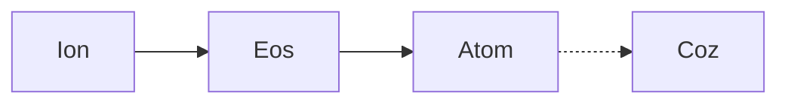
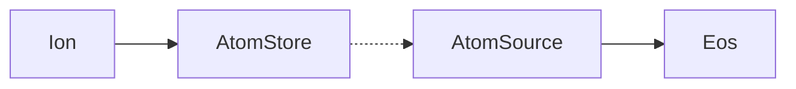
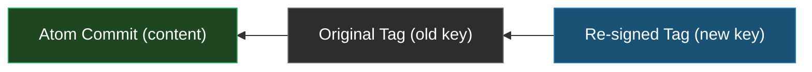

+++
title = "Atom: From Proof to Protocol"
description = "Decentralized source publishing, formally specified"
date = 2026-03-07
tags = ["atom", "nix", "systems", "protocol"]
[extra]
series = "atom-protocol"
series_order = 2
+++

## The Road So Far

In December 2024 I laid out a vision for what a post-Nix world of
store-based systems could look like[^nix-to-eos]: atoms as the
distribution primitive, a build engine called Eos scheduling work across
machines, and a frontend called `eka` making it all accessible. Five
months later, I walked through a working proof of concept[^atom-anatomy]:
a monolithic Rust crate that validated the core technical ideas.

This post is Part 1 of a series covering what happened next. The PoC
succeeded, but it also showed me where the design was too coupled, too
specific, and too fragile for the generality the vision demanded. The
atom protocol specifically has been rearchitected, formally specified,
and partially verified using model checking. This installment focuses on
that work. Future installments will cover the Eos build engine and the
Ion frontend (formerly `eka`, more on the rename shortly) in their own
right, along with the evolving Nix bridge.

First, some personal context.

### A Change of Orbit

I've moved my work out of the [Ekala](https://github.com/ekala-project)
ecosystem and established my own firm,
[Axiosophic Systems](https://axioso.ph). This deserves a frank explanation.

I fully support the Ekala project and don't preclude future collaboration
or crossover. But my trajectory is moving into territory where association
could become uncomfortable for others. I've grown unapologetically direct
about things most engineers prefer to treat as externalities: the
political capture of open-source governance, the structural degradation of
software freedom, and what I think an honest response to those trends
looks like.[^political-context] Going forward, axiosophic principles will
be woven into how I build, license, and talk about my work.

None of that belongs on Ekala's doorstep. They have their own mission, and
dragging them into my political positions uninvited would be neither fair
nor professional. Independence gives both efforts room to move. The new
project is currently under a restrictive no-commercial-use license,
intentionally temporary, as stated in the license itself. We're biasing
toward protecting the intellectual property until the right permanent
licensing arrangement is struck, one that balances free software ideals
with the realities of corporate capture. The intent is to have permanent
terms in place by the time the code is practically usable.

For anyone curious about the personal backdrop, I've written about it
elsewhere.[^personal] This post is about the protocol.

<div class="media-sidebar">
<div class="media-sidebar-inner">
<input type="checkbox" id="media-toggle" class="media-toggle" />
<label for="media-toggle" class="media-sidebar-label">video introduction</label>
<div class="media-sidebar-content">
<span class="media-sidebar-sub">the core ideas in under ten minutes</span>
<video controls preload="none">
  <source src="https://pod.nrd.sh/Architecting_a_Trustless_Package_Manager__The_Atom_Protocol.mp4" type="video/mp4" />
</video>
</div>
</div>
</div>

## Why This Matters

Before the technical deep-dive, it's worth asking: _why should anyone
care?_

The software supply chain is, as of this writing, held together with
baling wire. Package registries are centralized trust bottlenecks.
Provenance is aspirational at best. "Reproducible builds" is a phrase
most ecosystems applaud in conference talks and ignore in practice.
Dependency resolution is either fast-and-wrong (lockfiles pinned to
whatever `npm install` happened to produce) or correct-and-glacial
(SAT solvers over monorepos with no structural discipline).

The Nix ecosystem got closest to solving this. Its store model, content
addressing, and build sandboxing are genuinely revolutionary ideas,
ideas I've spent years working with and advocating for. But Nix's
tooling bolted user-facing concerns directly onto low-level derivation
mechanics, and the result is an ecosystem that's technically impressive
and practically alienating.[^nix-to-eos]

Atom is an attempt to get the architecture right. Not a Nix extension,
not a registry competitor, but a _protocol_ for decentralized,
cryptographically verifiable source publishing that any package ecosystem
can implement. It uses Git as its first backend because Git is ubiquitous,
but the protocol doesn't require Git. It uses
[Coz](https://github.com/Cyphrme/Coz) for signing because Coz is compact
and algorithm-agile, but the cryptographic substrate is pluggable.

What I'm proposing isn't revolutionary. It's disciplined. And in my
experience, discipline is what actually ships.

## What the Proof of Concept Validated

The original `eka` prototype validated five fundamental ideas:

1. **Git refs as a publishing substrate.** Atoms are published to refs
   like `refs/atoms/<id>/<version>`, allowing lightweight, server-side
   filterable discovery without downloading any objects. You query versions
   the way you query branches: a ref listing.

2. **Content-addressed identity.** Each atom gets a unique, deterministic
   machine identity derived from the repository's genesis commit and the
   atom's Unicode label. No registry, no UUID assignment authority,
   no coordination.

3. **Detached, reproducible snapshots.** Published atoms are orphaned
   commits wrapping just the relevant subtree, with reproducible metadata
   (blank author, epoch timestamp) so any party can independently verify
   the content hash. If two people snapshot the same content, they get the
   same commit hash. Period.

4. **Eval-time isolation.** The `atom-nix` module system used
   `builtins.scopedImport` to give each atom its own evaluation scope,
   preventing the kind of implicit cross-contamination that makes
   `nixpkgs` a scaling disaster.

5. **Full-scale version resolution.** This was the hardest validation and
   the one I'm most proud of, even though the implementation ended up too
   messy for production. We got transitive, efficient resolution working
   end-to-end: manifests declaring dependencies with semver constraints,
   a lock file pinning the resolution graph, and a SAT-solver-backed
   resolution engine that handled diamond dependencies, version conflicts,
   and atom store lookups in non-trivial real-world scenarios. The format
   itself was straightforward to implement. Getting resolution right took
   the majority of the effort.

The **atom store abstraction** also emerged from the PoC as a design
primitive that earned its keep. A local collection that accumulates atoms
from multiple sources through a uniform `ingest` interface, it cleaned up
the implementation dramatically and survived intact into the formal
rearchitecture. More on this below.

These ideas held up. The problems were structural.

## What Broke, and Why

The PoC was tightly coupled by design: it validated a specific workflow
(Nix-centric publishing with Git storage) rather than a general protocol.
As I started thinking about what a production architecture demanded, three
structural problems became clear:

**Coupling killed generality.** Git-specific types leaked into interfaces
that should have been backend-agnostic. The identity model was hardcoded
to BLAKE3. The manifest format was Nix-specific. Every aspect of the
design that should have been a pluggable trait was instead a concrete type.

**The URI parser was a grammar problem.** 764 lines of
[nom](https://github.com/rust-bakery/nom) combinators and seven bug-fix
commits ([`6602764`](https://github.com/ekala-project/eka/commit/6602764),
[`6693281`](https://github.com/ekala-project/eka/commit/6693281),
[`fbb7fe9`](https://github.com/ekala-project/eka/commit/fbb7fe9),
[`249abe6`](https://github.com/ekala-project/eka/commit/249abe6),
[`6495d5d`](https://github.com/ekala-project/eka/commit/6495d5d),
[`5efc6f1`](https://github.com/ekala-project/eka/commit/5efc6f1),
[`5814d87`](https://github.com/ekala-project/eka/commit/5814d87)).

The root cause wasn't parser bugs. The `:` character carried five different
meanings depending on context. Every new edge case spawned a new heuristic.
Heuristics interacted. Bugs compounded.

**There was no specification.** Nothing distinguished "this is the
protocol" from "this is how the prototype happened to implement it." When
I wanted to change the identity model, I had to audit the entire codebase
to find out which assumptions were load-bearing. That's the exact failure
mode that formal specifications exist to prevent.

I'd also seen this movie before. Nix started as a research project with no
ambition to become production infrastructure. When it turned into one
anyway, the research-grade architecture came with it, and it's been
maintenance hell ever since. I didn't want to ship a PoC, accumulate users,
and then discover that rearchitecting under load is ten times harder than
doing it now. Better to take the hit early.

These problems motivated a ground-up rearchitecture.

## The Scope Change: From Nix Format to Generic Protocol

The most fundamental shift in thinking, and the one worth emphasizing
before diving into specifics, is that **atom is no longer a Nix-specific
distribution format**. In the PoC, atoms were tightly coupled to `eka`'s
manifest schema, its resolution engine, and Nix as the target ecosystem.
That scope was appropriate for proving the concept, but it also hard-wired
decisions that should have been deferred.

The rearchitected atom is a _generic packaging protocol_. It defines how
to claim ownership of a named piece of source code, how to publish
versioned snapshots of it with cryptographic provenance, and how to
verify that chain of custody without trusting any central authority. What
it does _not_ define:

- A manifest schema. That's the frontend's job (Ion, or any other
  frontend that implements the protocol).
- A resolution algorithm. That's also the frontend's job.
- An evaluation or build strategy. That's the engine's job (Eos).

The atom protocol cares about two things: identity and provenance. The
`pkg` field in a claim payload (more on this below) identifies which
ecosystem an atom belongs to using
[PURL](https://github.com/package-url/purl-spec) type strings:
`"cargo"`, `"npm"`, `"pypi"`. Manifest discovery is delegated to
**ecosystem adapters**: thin layers that know how to find and parse the
manifest format for a given package type. An adapter for `"cargo"` knows
to look for `Cargo.toml`; one for `"npm"` looks for `package.json`. The
atom protocol itself never parses any of these. It just knows that such a
thing exists, has a label, and has a version.

This generalization turned out to clarify everything downstream. Identity
became simpler. The trait hierarchy became cleaner. The formal model became
possible.

## Architecture Overview

The `eka` CLI has been renamed to **Ion**. The name reflects its role as
the charged particle that connects everything: the user-facing frontend
that resolves dependencies, manages manifests, and drives the Eos build
engine. Where you used to type `eka add`, you'll now type `ion add`.

The monolith has been decomposed into a layered stack across three
independent Cargo workspaces:



Each layer has a strict one-way dependency: Ion depends on Eos and Atom,
Eos depends on Atom, Atom depends only on its own primitives and Coz for
signing. Nothing flows upward.

| Workspace | Responsibility                                       |
| :-------- | :--------------------------------------------------- |
| `atom/`   | Protocol: identity, addressing, traits, Git backend  |
| `eos/`    | Runtime: build planning, execution, artifact storage |
| `ion/`    | Frontend: manifests, SAT resolution, CLI             |

The crate count is currently around ten across the three workspaces,
though that will evolve as the architecture matures. The per-concern
decomposition might seem aggressive, but years of working on this
project have taught me one thing clearly: it's easier to fix a broken
abstraction within an established boundary than to extract a boundary from
a monolith after coupling has cemented around it. The PoC proved that the
coupling happens fast.

The remainder of this post focuses on the atom protocol: identity,
transactions, and the abstract trait hierarchy. The Git backend is one
implementation of these abstractions; I'll cover it after establishing
the abstract layer.

## Coz: The Cryptographic Substrate

Before discussing identity and transactions, I need to introduce
[Coz](https://github.com/Cyphrme/Coz), since it underlies all
cryptographic operations in the protocol.

Coz is a compact, algorithm-agile JSON signing format created by
[Zach Collier (zamicol)](https://zamicol.com/) of
[Cyphr.me](https://cyphr.me) as a response to the complexity of JOSE/JWT.
Where JOSE/JWT requires multiple RFCs, multiple encodings, and a sprawling
ecosystem of libraries to do basic signing, Coz is a single, coherent
specification: JSON in, signed JSON out, with self-describing algorithm
fields and no optional complexity.

Working with Zach has been one of the highlights of this period, and
my work with Cyphr.me is my first collaboration under the axiosophic
banner. I wrote the [Rust implementation](https://github.com/Cyphrme/coz-rust)
of Coz, and in the process became thoroughly convinced it was the right signing
substrate for atom. Coz messages are just JSON objects, which means they slot
cleanly into Git commit and tag messages. They're self-describing;
algorithm, key thumbprint, and payload type are all fields in the message
itself. And they're algorithm-agile: ES256, ES384, ES512, and Ed25519 are
all supported, with new algorithms added by defining a new `alg` string.

This matters for atom because the protocol needs signing that is compact
enough for Git object messages, verifiable without external infrastructure
for offline provenance checking, and resilient to algorithm migration.
Coz handles all of that.

## Atom Identity: From BLAKE3 to Coz-native

The PoC used a `Compute` trait to derive atom identity from a BLAKE3 keyed
hash over the repository's initial commit and the atom's Unicode label.
This worked, but it was structurally coupled to the Git backend ("initial
commit" is a Git concept) and hardcoded to a single hash algorithm.

The new identity model decouples these concerns completely.

### AtomId: The Abstract Identity

An atom's identity is the pair `(anchor, label)`:

```rust
struct AtomId {
    anchor: Anchor,  // opaque bytes, backend-derived
    label:  Label,   // UAX #31 identifier with explicit `-` exception
}
```

The `anchor` is an abstract cryptographic commitment to the atom-set's
origin. For the Git backend, it's the bytes of the repository's genesis
commit hash. For a future backend, it could be anything that satisfies
four properties: immutable, content-addressed, collision-resistant, and
discoverable without trusting the publisher.

The `Label` is a UAX #31 Unicode identifier with one deliberate exception:
hyphens (`-`) are allowed. Virtually every package ecosystem uses hyphens
in package names, and forbidding them would create a mapping headache at
the boundary.

The critical design decision: **AtomId is algorithm-free and permanent.**
It doesn't change across versions, ownership transfers, or key rotations.
It doesn't depend on which hash function you use or which signing scheme
is in play. It's the abstract identity of a named piece of source code
within a particular origin.

### AtomDigest: The Store-Level Representation

For indexing, wire formats, and Git ref paths, you need a compact
representation. That's `AtomDigest`:

```rust
struct AtomDigest {
    alg: Alg,   // ES256 | ES384 | ES512 | Ed25519
    cad: Cad,   // canonical hash of {"anchor": <b64ut>, "label": <str>}
}
```

The digest is computed using Coz's `canonical_hash_for_alg` function with a
fixed field canon `["anchor", "label"]`. Multiple valid digests exist for
the same `AtomId`, one per algorithm. The display format is `alg.b64ut`,
which is safe for Git references.

This separation means:

- The identity layer has zero hash algorithm dependencies
- Stores can choose their own hash algorithm
- Algorithm migration doesn't alter atom identity
- Different stores can use different algorithms for the same atom

## The Transaction Model

The protocol defines exactly two transactions. Both are Coz-signed payloads
with formally specified field canons.

### Claim: Establishing Ownership

A claim asserts: "I own this `(anchor, label)` pair, signed with this key."

```json
{
  "alg": "Ed25519",
  "anchor": "<b64ut bytes>",
  "label": "my-atom",
  "now": 1709827200,
  "owner": "<identity digest>",
  "pkg": "cargo",
  "src": "<source revision hash>",
  "tmb": "<key thumbprint>",
  "typ": "atom/claim"
}
```

The `owner` field is intentionally opaque: it's a cryptographic identity
digest whose interpretation depends on the identity framework in use. A
single raw key's thumbprint, a GPG master key's fingerprint, or a Cyphr
principal digest all work. The protocol doesn't prescribe an identity
system; it provides a slot for one.

The `src` field establishes a **temporal floor**: it pins the claim to a
specific point in the repository's history. You can only publish atoms from
revisions at or after the claim's `src`. This creates the first link in
what I call the **authenticity vector**.

The `pkg` field identifies the ecosystem using PURL type strings where
possible. This is how the ecosystem adapter (the thin layer mentioned
earlier that maps package types to manifest formats) discovers what to
parse. The atom protocol itself never prescribes a manifest schema; `pkg`
is the interface through which the generic protocol connects to specific
package ecosystems.

A claim must include the public key (`key` field) for trust-on-first-use
(TOFU) verification. Consumers can verify a claim without any external key
discovery infrastructure.

### Publish: Releasing a Version

A publish asserts: "Version X of this atom contains the content at this
digest, extracted from this source revision."

```json
{
  "alg": "Ed25519",
  "anchor": "<b64ut bytes>",
  "claim": "<czd of authorizing claim>",
  "dig": "<atom snapshot hash>",
  "label": "my-atom",
  "now": 1709913600,
  "path": "crates/my-atom",
  "src": "<source revision hash>",
  "tmb": "<key thumbprint>",
  "version": "0.1.0",
  "typ": "atom/publish"
}
```

The `claim` field chains publish to claim. It contains the `czd`
(Coz digest) of the authorizing claim, creating a cryptographic binding.
This is enforced by data flow, not convention: you literally cannot
construct a valid publish payload without having completed a claim first,
because you need the claim's `czd` as an input field.

The `dig` is the content-addressed hash of a **deterministic atom
snapshot**: a parentless commit with blank author/committer, epoch
timestamp, empty message, and a single `src` extra header containing the
source revision's object ID. Given the same content tree and the same
source revision, any party produces an identical commit hash. This is the
reproducibility guarantee.

The `path` field records where in the source tree the atom's content lives.
Together with `src`, it enables provenance verification: a consumer can
fetch the source revision, navigate to `path`, and confirm that the subtree
matches the atom's content tree.

Both claims and publishes support an optional `meta` object for
extensible, namespaced metadata. On publishes, this opens up a
particularly useful capability: the `meta.artifact` field can carry the
content-addressed hash of the final built artifact. If a publisher builds
the atom and records the artifact digest in the publish transaction, then
anyone who independently builds the same source can compare their output
hash against the signed one. Reproducibility becomes not just a property
of the source snapshot but of the entire build pipeline, verifiable by
any third party.

### The Authenticity Vector

These fields compose into a three-point chain:

$$\text{genesis} \rightarrow \text{claim.src} \rightarrow \text{publish.src}$$

Each arrow is a DAG ancestry check in the repository's commit graph. The
genesis commit must be an ancestor of the claim's source revision, which
must be an ancestor-of-or-equal-to the publish's source revision. This
creates a temporal ordering that **prevents backdating**: you cannot publish
content from before your claim existed.

Verification is entirely local. Given the atom snapshot, the publish
transaction, and the claim transaction, a consumer can check everything
offline:

| Step | Check                                                   |
| :--- | :------------------------------------------------------ |
| 1    | Atom snapshot hash matches `dig`                        |
| 2    | Claim signature valid                                   |
| 3    | Publish signature valid                                 |
| 4    | Key thumbprint matches signer                           |
| 5    | Publish chains to claim (`publish.claim == czd(claim)`) |
| 6    | Temporal ordering (`publish.now > claim.now`)           |
| 7    | Signer authorized by `owner`                            |
| 8    | AtomId derivable from `(anchor, label)`                 |

With minimal network access, provenance verification extends the chain
further:

| Step | Check                                                              |
| :--- | :----------------------------------------------------------------- |
| 9    | Fetch source revision metadata at `publish.src`                    |
| 10   | Walk source tree to `path`, confirm subtree hash matches atom tree |
| 11   | Reconstruct atom snapshot independently (deterministic commit)     |
| 12   | Verify reconstructed snapshot hash equals `dig`                    |

Full history isn't required, just commit metadata and tree structure. The
[atom transactions spec](https://github.com/axiosoph/axios/blob/master/docs/specs/atom-transactions.md)
covers these verification steps in full.

The underlying principle here is what I've started calling **surety of
source**: an atom's authenticity rests entirely on its cryptographic chain
back to the source repository, not on trust in whatever store or mirror
delivered it. Stores are transport. The chain is proof. If the signatures
check out and the hashes match, the atom is genuine regardless of where
you got it.

Compare this with the status quo: most package registries offer, at best,
a checksum over a tarball produced by opaque infrastructure you cannot
audit. Surety of source inverts that model. You don't trust the registry;
you verify the chain.

## The Trait Hierarchy: Protocol Abstractions

Identity, transactions, and verification are all defined against
**abstract traits**, not concrete implementations. The Git backend is one
realization of these traits. A future backend based on an append-only log,
a content-addressed store, or even a database could implement the same
interfaces if it satisfies the same invariants. The abstractions come
first; backends are pluggable.

The protocol defines three core traits, each modeled as a coalgebra in the
[formal model](https://github.com/axiosoph/axios/blob/master/docs/models/publishing-stack-layers.md).
The coalgebraic framing is the right tool because traits in Rust _are_
behavioral observers: they specify what you can observe about an opaque
state, not how it's constructed. Bisimulation is the natural equivalence:
two implementations are equivalent if no downstream consumer can
distinguish them.

### AtomSource: Read-Only Observation

```rust
trait AtomSource {
    type Entry;
    type Error;
    fn resolve(&self, id: &AtomId) -> Result<Option<Self::Entry>, Self::Error>;
    fn discover(&self, query: &Query) -> Result<Vec<AtomId>, Self::Error>;
}
```

$$F_{\text{source}}(S) = (\text{AtomId} \to \text{Option}\langle\text{Entry}\rangle) \times (\text{Query} \to \mathcal{P}(\text{AtomId}))$$

Two implementations are **bisimilar** if `resolve` and `discover` agree
pointwise. Any implementation containing the same atoms is
interchangeable from the consumer's perspective; whether it's backed
by Git refs, a database, or an in-memory cache.

### AtomRegistry: The Publishing Interface

```rust
trait AtomRegistry: AtomSource {
    fn claim(&self, req: ClaimReq) -> Result<Czd, Self::Error>;
    fn publish(&self, req: PublishReq) -> Result<(), Self::Error>;
}
```

The trait inheritance `AtomRegistry: AtomSource` is a **forgetful functor**
in the coalgebraic sense: drop the `claim`/`publish` observers and you
get a plain `AtomSource`. This means any code that reads atoms can read
from a registry without knowing or caring that it has publishing
capabilities.

### AtomStore: The Working Collection

```rust
trait AtomStore: AtomSource {
    fn ingest(&self, source: &dyn AtomSource) -> Result<(), Self::Error>;
    fn contains(&self, id: &AtomId) -> bool;
}
```

The store is the abstraction that emerged from the PoC and survived
intact. It's a local collection that accumulates atoms from any source —
remote registries, local development trees, other stores — through a
uniform `ingest` interface. The critical property is the **accumulation
guarantee**:

$$\forall\; \text{source}, \forall\; \text{id}: \quad \text{resolve}(\text{store}, \text{id}) \supseteq \text{resolve}(\text{source}, \text{id})$$

After ingestion, the store returns at least everything the source returned.
Identity is preserved through `ingest` because `AtomId` is
backend-agnostic. Published atoms and local development atoms enter the
same store through the same interface.

### The Dependency Firewall

The build engine (Eos) reads atoms through `AtomSource`, not `AtomStore`.
Ion populates the store, then Eos reads from it through a trait cast that
strips the mutation interface:



This isn't just convenient layering. The forgetful functor is a
**structural dependency firewall**: Eos cannot depend on mutation
operations because its type signature literally does not have access to
them. The Rust type system enforces this, not convention, not code review,
not good intentions.

### Why This Abstraction Matters

These three traits define the protocol's contract. Any backend that
implements them correctly is a valid atom host. Git happens to be the first
and most natural backend, but the trait hierarchy ensures it's not the
only possible one. The formal model validates this: deployment modes
(embedded, daemon, remote) are provably interchangeable if they produce
the same observations through these traits.

## The Git Backend

With the abstract layer established, let's look at how Git implements it.
The
[Git storage spec](https://github.com/axiosoph/axios/blob/master/docs/specs/git-storage-format.md)
defines four categories of Git objects:

1. **Genesis commit** — the oldest parentless commit in the repository's
   history (by committer timestamp). Its ObjectId bytes become the anchor.

2. **Claim commits** — commits with the well-known empty tree
   (`4b825dc...`) whose message is a Coz-signed claim payload. First
   claims are parentless; subsequent claims (key rotation) parent to the
   previous claim commit, forming an auditable ownership chain.

3. **Atom commits** — parentless, deterministic commits whose tree is the
   atom's content and whose `src` extra header records the source revision.
   The commit hash is the `dig` in the publish payload.

4. **Publish tags** — annotated Git tag objects pointing at atom commits
   (initial) or at a previous publish tag (updates). The tag message is a
   Coz-signed publish payload. Update tags form a chain; Git's tag-peeling
   resolves through to the underlying content.

### Two Address Spaces

A Git repository can serve as both a **registry** (source-side, implements
`AtomRegistry`) and a **store** (consumer-side, implements `AtomStore`).
The ref layouts differ because they serve different access patterns:

**Registry** (human-readable, addressed by label):

```
refs/atom/claims/pub/{label}        → claim commit (tip of chain)
refs/atom/pub/{label}/{version}     → publish tag → atom commit
refs/atom/src/{oid}                 → source commit (GC protection)
```

**Store** (machine-addressed, by claim czd):

```
refs/atom/d/{claim_czd}/{version}   → publish tag → atom commit
refs/atom/claims/d/{claim_czd}      → claim commit (shallow-fetched)
refs/atom/dev/{atom_digest}/{ver}   → atom commit (unsigned dev atoms)
```

The registry addresses atoms by `label` because that's how humans think
about their packages. The store addresses by `claim_czd` because that's
globally unique. Two forks of the same repository sharing the same anchor
and label produce different claims with different czds, naturally occupying
different ref paths. No conflict resolution needed.

The `dev/` namespace handles filesystem-sourced atoms that have never been
published. These are ingested without claims or publish tags, referenced by
their `AtomDigest`. This is the local development path: evaluate atoms from
your working tree without publishing anything.

### Claim Chains and Key Rotation

Key rotation is a first-class protocol operation:


The ref `refs/atom/claims/pub/{label}` always points to the tip. The full
ownership history is walkable from there. Since claims have empty trees,
fetching the entire chain is lightweight: just commit objects.

The protocol supports advisory metadata on claim replacements:

```json
{
  "meta": {
    "supersedes": "revoke",
    "announcement": "https://example.com/disclosure",
    "effective-after": 1709740800
  }
}
```

`"supersedes": "update"` covers routine rotation; `"revoke"` signals
compromise. The `effective-after` field limits blast radius: only versions
published under the old claim after this timestamp are suspect.

### Publish Tag Chains

If you need to re-sign a version (after key rotation, or to add security
metadata), you create a new tag targeting the previous one:



Immutable payload fields (`label`, `version`, `dig`, `src`, `path`) must
be identical across the chain. Only signing metadata and extension fields
may differ. Git's tag-peeling resolves the chain to the underlying atom
commit. Lock files referencing old tag ObjectIds remain valid.

## Formal Verification

Before writing implementation code for the new architecture, the trait
boundaries and protocol semantics were formalized using three
complementary approaches. After years of experimental work on the PoC,
formal modeling felt like a natural next step: take the lessons learned
and nail them down before getting locked into another implementation.
Most protocol bugs aren't implementation errors; they're specification
gaps. Model checking is how you find those gaps before they become CVEs.

### Coalgebras: Behavioral Equivalence

Each trait defines a coalgebra. The key validation result:
**deployment modes are formally interchangeable.** The `BuildEngine`
coalgebra proves that embedded, daemon, and remote engine implementations
are equivalent if they produce the same plans and outputs. This means
`ion build` works locally with a compiled-in engine today, and can
transparently switch to a remote Eos daemon later, without changing a
line of Ion's code.

### Session Types: Protocol Ordering

Session types capture ordering constraints:

**Publish session:**

$$!\texttt{ClaimReq} \;.\; ?\texttt{Result}\langle\texttt{Czd}\rangle \;.\; !\texttt{PublishReq} \;.\; ?\texttt{Result}\langle()\rangle \;.\; \mathbf{end}$$

Claim must succeed before publish. This isn't just an API convention,
it's enforced by data flow (you need the claim's `czd` to construct a
valid `PublishReq`).

The session type analysis also revealed a structural property of the build
pipeline. Eos organizes builds around a `BuildPlan` enum with three
variants: the artifact already exists (skip), the plan exists but needs
execution (build), or nothing is cached (evaluate, then build). These
correspond to three cache-skipping levels in the cryptographic chain
from $\texttt{AtomId} \rightarrow \texttt{Version} \rightarrow \texttt{Revision} \rightarrow \texttt{Plan} \rightarrow \texttt{Output}$. The session type
analysis showed this hierarchy is **isomorphic to the build protocol
itself**; the cache isn't a bolt-on optimization but a structural
property of the protocol's state machine. This will be covered in depth
in the Eos installment.

### TLA+ and Alloy Model Checking

The invariants are model-checked:

- **TLA+**: verified across two configurations (fork scenario: 31,593
  states; distinct-anchor: 27,817 states). All safety-critical temporal
  invariants pass: identity stability, publish-chains-claim, session
  ordering, no unclaimed publish, no duplicate version, no backdated
  publish.

- **Alloy**: verified at scope 4 by Alloy Analyzer 6.2.0. All five
  structural assertions pass: identity is content-addressed, ownership is
  independent of identity, ingest preserves identity, manifests carry
  at minimum label and version (ecosystem adapters may add further fields).

These aren't toy models. The TLA+ spec captures the full state space of
claim and publish interactions, including fork scenarios where competing
claims exist for the same `AtomId` across repositories that share an
anchor. It found no violations.

## URI Grammar: Lessons in Language Design

The URI parser's seven bug-fix commits all traced to a single root cause:
the `:` character carried five different meanings depending on context.
Every new disambiguation heuristic interacted with every existing one.

The fix was a grammar redesign. Aliases now use a `+` sigil:

| URI                               | Form       | Disambiguation                    |
| :-------------------------------- | :--------- | :-------------------------------- |
| `+gh/owner/repo::my-atom@^1.0`    | alias      | explicit `+` sigil, `/` delimiter |
| `git@github.com:owner/repo::atom` | SCP        | `gix::Url` handles this           |
| `https://host/repo::atom`         | URL        | has `://`                         |
| `/local/path::atom`               | local path | starts with `/`                   |
| `my-atom@^1.0`                    | bare label | no prefix, optional `@version`    |

The `+` sigil eliminates alias-vs-everything disambiguation entirely. URL
parsing is delegated to [gix](https://github.com/GitoxideLabs/gitoxide).
The parser shrinks from 764 lines to roughly 100–150 lines of
classification logic.

The core URL aliasing function is being extracted into its own minimal,
generic library, independent of atom, so other CLI tools can benefit
from the same expansion. If you've ever wished your toolchain let you
define `+gh` → `https://github.com` shortcuts, that's what this is.

The lesson: if your parser has accumulated half a dozen bug fixes for the
same class of problem, the parser isn't buggy. The grammar is.

## Cyphr: A Teaser

I mentioned [Cyphr.me](https://cyphr.me) earlier in the context of Coz. The
broader Cyphr protocol, a self-sovereign identity system with zero-trust
derivation hierarchies, is being developed by the firm's head, Zach Collier,
in collaboration with Axiosophic Systems, and is currently in private
development. I want to be explicit about three things:

1. **Cyphr is Zach's creation.** I'm a collaborator, not the architect.
   My contribution is the Rust implementation of Coz and integration
   and implementation work. The protocol vision is his.

2. **The core Cyphr protocol is not yet public.** What's on cyphr.me
   reflects some of the early ideas, but the protocol itself is still
   being iterated on privately.

3. **Cyphr is not a dependency of atom.** Atom uses Coz for signing, and
   that relationship is stable and productive. When Cyphr matures, it will
   provide infrastructure for key management, rotation, and independent
   auditing, features that plug into the opaque `owner` field in claim
   payloads. The protocol doesn't change; only the authorization semantics
   behind `owner` become richer.

I'll have more to say about Cyphr when the code is public. Probably on the
official cyphr.me blog.

## What's Next

This post covered the atom protocol layer: identity, transactions,
abstract traits, the Git backend, and formal verification. The subsequent
installments will cover:

- **Eos**: the build engine. Plan/apply with cache-skipping at every
  stage of the cryptographic chain. Embedded by default, distributed
  daemon opt-in. Non-interfering parallel builds. Error recovery with
  session-typed delegation.

- **Ion**: the frontend. `ion.toml` manifests with a Compose system.
  SAT-based resolution with a unified lock file covering both atom
  dependencies and legacy Nix inputs. Dev workspace management for
  multi-atom monorepos.

- **The Nix bridge**: how `atom-nix`'s evaluation-time sandboxing carries
  forward into the new architecture, and what changes when the build engine
  handles scheduling rather than relying on Nix's evaluator for everything.

The specifications, ADRs, and formal models live at
[github.com/axiosoph/axios](https://github.com/axiosoph/axios), with the
reference implementation under active development. For the broader context
on _why_ supply chain integrity, auditable systems, and true software
freedom matter, why this isn't just an engineering exercise but a
structural defense of something I consider essential, I've written about
what's at stake[^why-it-matters] and what I think a principled response
looks like.[^axiosophy]

Viva Rebellion.

## _References_

[^nix-to-eos]: [From Nix to Eos](./nix-to-eos) — the original vision piece covering the high-level architecture and the motivating problems with Nix's approach.

[^atom-anatomy]: [Anatomy of an Atom](./atom-anatomy) — the PoC walkthrough covering identity, storage, versioning, and the Nix frontend.

[^political-context]: See [The Closing of Open Source](./closed-openness) on institutional capture, [Declaration of Rebellion](./code-of-rebellion) on the philosophical framework, and [NixOS Policy Breakdown](./nixos-policy-breakdown) on what this looks like in practice. The full treatment lives in [Axiosophy](./axiosophy).

[^personal]: [Twelve Years](./12-years) and [Letter to My Children](./letter-to-my-children).

[^why-it-matters]: [The Closing of Open Source](./closed-openness) — on the structural degradation of open-source governance and corporate capture of community infrastructure.

[^axiosophy]: [Axiosophy](./axiosophy) — the full philosophical treatment, deriving engineering ethics from natural constraints.
