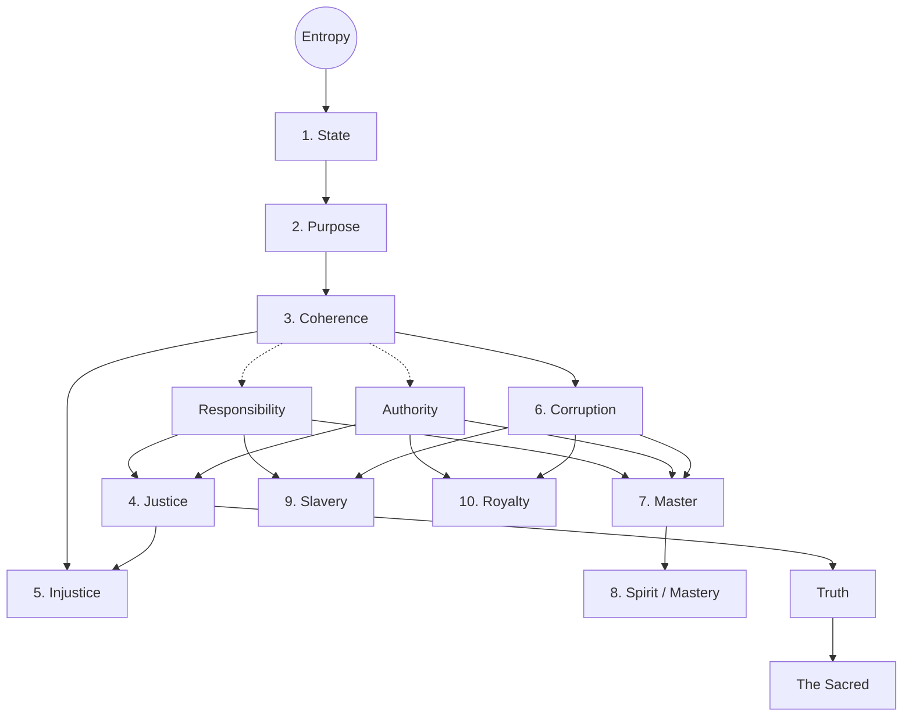
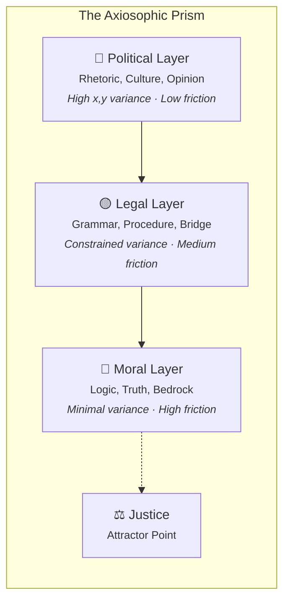

+++
title = "Axiosophism"
description = "An Axiomatic Philosophy Toward Justice and Truth"
date = "2025-08-31"
draft = false

[taxonomies]
tags = ["politics", "civilization", "philosophy"]
+++

## An Axiomatic Philosophy Toward Justice

### Preamble

Let us begin, dear reader, as if we were conversing in the marketplace of ideas, much like Socrates might have done. Imagine we are walking together, pondering the great upheavals of life. For me, the trials of the past year — personal storms that have tested my resolve — have led me to forge a new philosophy: **Axiosophy**, and its political companion **Axiosophism**. What is this, you ask? It draws from the Greek words *axios*, meaning worthy or axiomatic, and *sophia*, wisdom. Thus, it is the pursuit of wisdom through axioms — self-evident truths — from which we derive moral and social principles to master the chaos around us.

Why such a framework? Many philosophies rely on fleeting emotions or unproven assertions, leaving us adrift in debate. Axiosophy seeks clarity. It builds from an undeniable starting point — the law of entropy — and derives everything else with mathematical rigor. It arises not just from abstract thought but from real struggles, such as my ongoing battle against biases in family courts (explored in detail via [legal filings](../no-fault-tyranny)). Yet, this is no mere personal vendetta. It reveals a broader pattern of elite "Royals" consolidating power through clever words and false divisions, preying upon the common folk.

As Socrates declared in his defense, "The unexamined life is not worth living,"[^1] so too does Axiosophy urge us to examine deeply, lest we succumb to unthinking decay. Shall we explore this together, step by step, questioning as we go?

---

### Part I: Foundations

#### The Impenetrable Question of God and Logic's Limits

Consider first the ancient riddle: Does God exist? It seems a simple yes or no, yet it eludes us. Why? Because logic itself has boundaries, as proven by Kurt Gödel in his 1931 Incompleteness Theorems.[^2] Picture a system of rules, like mathematics: Gödel showed that no such system can be both complete (proving all truths within it) and consistent (free of contradictions). If complete, it breeds paradoxes; if consistent, some truths remain unprovable.

The existence of God might be one such unprovable truth. Society often ignores this, chasing grand theories amid floods of data, which only spawn illusions — in our minds and even in artificial intelligences. But if logic cannot settle this, must we despair? No. Let us ask: What if we turn instead to what we *can* know and build from there?

#### Coherence vs. Chaos: The Need for a Shared Sacred

This limit is not a dead end but an invitation to shift our gaze. Why obsess over the unknowable when we can derive ethics from firm foundations? Imagine believers and atheists alike uniting under shared reason — this could heal divisions and expose true adversaries hidden in the noise. The real battle, I propose, is not faith versus doubt, but **coherence versus chaos**. Chaos afflicts everyone. It is fueled by what I call Corruption: deliberate muddling that speeds disorder, blurring friends from foes in our cultural battles.

But how to combat this? We need a **Sacred** — not necessarily divine, but logically derived principles worthy of fierce defense. History shows societies crumble without such shared anchors.[^3] Precise definitions can rally those who value reason against Corruption's wielders, the Royals. This tension between order and disorder runs through all things, from nature's laws to the ideal society. Let us define these terms carefully, as Socrates would, to build our understanding.

#### The Primacy of Entropy

At the heart of Axiosophy lies a single axiom: the Second Law of Thermodynamics. What is entropy, you inquire? In nature, it is the inevitable tendency of order to dissolve into disorder — like a hot cup of tea cooling, its heat spreading out until uniform and useless.[^4] This is self-evident; we see it in crumbling ruins and forgotten knowledge.

But why choose entropy as our starting point over, say, Aristotle's purpose-driven world (which assumes inherent goals without proof) or Kant's absolute duties (which feel intuitive but lack empirical backing)? Entropy stands superior because it is *verifiable*: rooted in thermodynamics and extendable to human affairs via information theory, where Shannon entropy measures uncertainty or fuzziness in systems.[^5]

Formally, for any social system left to natural forces:

$$\frac{dH}{dt} > 0$$

This is our bedrock. Any moral system that ignores it will hasten collapse; thus, ethics must promote coherence to endure.

**But doesn't this commit the naturalistic fallacy — deriving "ought" from "is"?**

No. And this is a critical point. Axiosophy does not say "entropy exists, therefore you *must* resist it." That would be a categorical imperative — Kant's error in different clothing. Instead, Axiosophy operates in what we might call a *constraint-theoretic* mode of ethics, genuinely distinct from both Kant's categorical imperatives and Mill's consequentialism:

- You don't  have a *moral duty* to obey gravity. You simply fall if you ignore it.
- You don't have a *moral duty* to resist entropy. Your society simply collapses if you fail to.

The "ought" is hypothetical, not absolute: *If* you seek coherence — if you want your State to endure — *then* you are structurally constrained to enact Justice.[^nat1] This is neither a moral command nor an outcome optimization. It is a structural constraint that emerges from the physics of coherence itself, much as the constraints of gravity emerge from the physics of mass.[^nat2] [^nat3]

Does this apply beyond physics? Yes — think of societies as living systems, as Ilya Prigogine described with his dissipative structures: systems that maintain order by expelling disorder but eventually succumb without effort.[^6] Contrast this with utilitarianism, which chases short-term pleasure but overlooks long-term decay, or relativism, which erodes shared truths altogether. Empirically, empires like Rome or the Maya fell to such entropy, traceable through rising inequality (Gini coefficients) or eroding trust.[^7] [^8]

So, entropy is our bedrock — question it, and see if another axiom holds as firmly.

---

### Part II: The Framework

#### From Entropy to Justice: The Axiosophic Hierarchy

Let us build, definition by definition, from our axiom. But first, a crucial structural observation: these definitions do not form a simple numbered list. They form a **directed acyclic graph** — a branching tree of logical dependencies. What must be defined *first* constrains what can be defined *after*.

**Entropy** is the relentless spread of coherence into chaos. From here:

1. A **State** is any naturally organized entity — a nation, family, or codebase — that actively resists this pull toward disarray.

2. Its **Purpose**? To preserve **Coherence**: action that effectively reduces entropy, like a well-tended garden against weeds.

3. The State is **Responsible** to *act* Coherently, exercising **Authority** to uphold its Purpose. These two — Responsibility and Authority — are the compositional prerequisites for everything that follows.

4. **Justice** is the consistent application of unambiguous rules toward this Purpose — the product of Responsibility and Authority directed at coherence. Formally: $Justice \cong \text{Responsibility} \times \text{Authority} \xrightarrow{\text{toward}} \text{Purpose}$.

5. **Injustice** is the inevitable march of entropy should the State fail to enact Justice.

6. **Corruption** is *intentional*: speeding entropy for selfish ends, like a guardian plundering the treasury. Not mere failure — deliberate sabotage.

Now the hierarchy branches. In the *context* of Corruption — its existence as a force to be reckoned with — three classes of actor emerge:

7. The **Master** is one who develops *both* Responsibility and Authority within this context, cultivating **Rebellion**: an unapologetic resistance to Corruption. The Master is the full product: $Master \cong \text{Responsibility} \times \text{Authority} \times \text{Corruption}_{\text{context}}$.

8. The **Spirit** is the animating energy behind coherence, expressed as **Mastery**: the free pursuit of excellence through skill and discipline, unhindered. The inevitability of Injustice and Corruption in a State fosters a collective [Spirit of Rebellion](../code-of-rebellion#a-state-of-rebellion) among its Master class.

9. **Slavery** is the *broken projection* — Responsibility without Authority. Forced to bear duty but stripped of power to act on it. Structurally: $\Box(Slavery \to \frac{dH}{dt} \gg 0)$ — slavery doesn't merely harm individuals; it *accelerates entropy system-wide*.

10. **Royalty** is the *mirror-image* broken projection — Authority without Accountability. Power hoarded, duty shirked. The elite who sustain Corruption through lies, hoarding power at others' expense.

These are not merely moral labels. They are **structurally symmetric**: Slavery and Royalty are each missing exactly one leg of the product that constitutes Mastery. The framework equally diagnoses both pathologies.[^9]

#### Truth and the Sacred

With these foundations laid, let us clarify **Truth**. It is not mere opinion or fleeting belief, but that which has been empirically demonstrated to aid a State in upholding its Purpose — sustaining coherence against entropy's tide. For instance, the principle of equal justice under law proves true because societies that embrace it endure longer, their order fortified against arbitrary decay, as seen in stable republics versus tyrannies.

From this emerges the **Sacred**: those truths that have been rigorously battle-tested across eras and contexts, consistently revealing their efficacy in preserving coherence. The family, as we shall explore, exemplifies this — time and again, strong familial bonds have anchored civilizations, transcending personal desires to safeguard the greater whole. The Sacred is not declared by authority. It is *discovered* through the relentless filter of entropy over time.[^3]

This yields a philosophy unburdened by dogma, directing us to measurable order rather than vague notions of "progress" that so often invite dissolution. Shall we proceed to apply these ideas?

#### The Ethical Constraints

A philosophy grounded in physics must make its ethical claims with equal precision. The structural implications of the hierarchy are not moral commands — they are thermodynamic consequences:

1. **The Necessity of Justice:** $\Box(\neg Justice \to \neg Coherence)$ — the absence of Justice necessarily leads to the failure of Coherence.

2. **The Inevitability of Rebellion:** $\Box(Corruption \to \diamondsuit Rebellion)$ — the presence of Corruption eventually necessitates the emergence of Rebellion among Masters, or the State collapses.

3. **The Entropy of Slavery:** $\Box(Slavery \to \frac{dH}{dt} \gg 0)$ — slavery actively accelerates entropy. It is not merely unjust but structurally destabilizing.

These are not oughts. They are structural if-thens. The bridge between observation and theory, between *is* and *should*, is not a moral leap — it is a hypothetical imperative grounded in the physics of coherence.

#### The Axiosophic Prism: A New Model of Social Coherence

Our world defies simple left-right lines. How might we envision a third dimension? The $x$-axis spans the familiar ideological spectrum, liberal to conservative; the $y$-axis measures from anarchy to oligarchy. What if our $z$-axis delves into *depth* — from what is superficial to what is deeply understood and well supported?

We can formalize it: Think of viewpoints as points in a metric space $\mathcal{M}$ — (ideology, power structure, depth) — converging downward, like a funnel, through [Bayesian reasoning](https://en.wikipedia.org/wiki/Bayesian_inference) toward what sustains coherence. As depth increases ($z \to z_{max}$), the variance in ideology and power structure strictly decreases — an **epistemological contraction mapping** converging on a single attractor: Justice.

| Affinity | Layer | Characteristics | Friction |
|:---|:---|:---|:---|
| Politics | Surface (Blue) | Rhetoric, cultural norms | Low (easiest to shift) |
| Law | Bridge (Yellow) | Grammar, procedure | Medium |
| Morality | Bedrock (Red) | Logic, introspective truth | High (resists change) |

> Note: Axiosophism does also consider the 4th dimension of time. However, for the sake of brevity, we shall leave that exploration to a future piece.

This is a crucial observation, as it flies in the face of modern conventions of "position posturing," where vehemently denouncing your enemy's position is assumed a great moral virtue. Worse still are the technologies that *automate* this purity spiral, systematically censoring dissent, when it is demonstrably *inquiry*, not denunciation, which cultivates Coherence and, in the proper Spirit, Justice. Axiosophy demands we address these engines of Corruption, redoubling a sense of urgency in decisive, coherent action.

Still further, our $z$-axis gauges viewpoint depth, exposing extremism's often shallow perspective. Policies are judged by real outcomes, not relativistic "inclusion" or affiliatory appeals.

Thus, the Axiosophic imperative emerges: delve beyond conflicting rhetoric to discern empirical truth, demarcate and defend the Sacred, and thereby uphold Justice through coherent action.

---

### Part III: The Spirit

#### The Rebirth of the Spirit: Will, Desire, and Mastery

Morality, the prism's deep base, demands reviving the Spirit — forgotten and in hiding, accelerating our decline. Nietzsche influenced this, decrying past moral efforts as immoral themselves. He observed: "All the means by which one has so far attempted to make mankind moral were through and through immoral," suggesting immoralists as the cure.[^10] His diagnosis rings true, but his prescription faltered, yielding a century of incoherent positivism.

Instead, Axiosophy sees morality as adaptable natural law, contextual to preserve order. Abandon it, and chaos reigns. Nietzsche missed this dynamism. The Spirit is no brute force but a guide pursuing the truly good via refined taste and discipline, enabling **Mastery** over self and environment.

The Spirit is a mysterious yet observable human facet — like will or logic — perhaps subconscious, cosmic, or divine, steering toward alignment. When pursued, it yields unexpected alignments and opportunities, empirically seen in lives of purpose.

To access the Spirit, one must pursue the **Will** — the sole element under our daily control, often weakened by distractions. Strengthening it demands taming baser desires through discipline, committing to what one *ought* to do, even amidst adversity.

The interplay between Will and Spirit is essential: faithful pursuit of Will, even when stifled or outcomes falter, eventually manifests the Spirit. This refines one's conception of Will, presenting unforeseen paths that lead where needed. Not magic, but the cumulative fruit of consistent, disciplined action over time — trusting process over immediate control.

This leads to Mastery: autonomy with balanced authority and duty — contrasting Slaves (duty without power) and Royals (power without duty). Deliberate Corruption directly stifles this path, undermining the mechanism that counters Entropy and sustains Justice. Thus, fostering Mastery via Will, guided by Spirit, sustains Justice.

#### Context is King

AI ethics returns us to context, and again to Nietzsche who, in *Twilight of the Idols*, condemned morality "for its own sake," labeling it "an idiosyncrasy of degenerates which causes immeasurable harm."[^70] He insightfully identifies a crucial flaw: if morality is merely an abstract, self-serving construct, it is indeed useless.

Axiosophy's rebuttal is that effective morality is definitively not "for its own sake." Rather, it directly engages the concerns, considerations, and contrivances of life, grounded in logical soundness, unambiguous application, and — most crucially — delivering value, wholeness, understanding, and depth of experience.

Nietzsche's greatest error was an incomplete grasp of this context. His proclamation of the "death of God" was prophetic yet hubristic, effectively abandoning the Spirit that had guided humanity. By dispensing with the "soul" and Reason itself, he neutered the impulse driving purposeful speech and intention, carelessly discarding the notion of the truly Sacred.[^71]

Contextual State understanding discerns error from Corruption, identifying allies via their commitment to coherence. Failing to adapt to dynamic ideals leaves us precarious and rigid — or, in other words, dogmatic. Axiosophy, then, demands vigilance and contextual awareness to discern what is true at any given time.

---

### Part IV: Applied Axiosophy

#### Institutional Decay: Purpose Drift and the Metric of Intervention

Our framework is not merely theoretical. It diagnoses real-world pathology with precision. Lawrence Lessig documented what he called "institutional corruption" — not the acts of "bad souls," but a systemic problem where *legal, even ethical* influences divert an institution from its original purpose.[^lessig]

This maps directly onto axiosophic concepts:

| Axiosophic Concept | Lessig's Framework |
|:---|:---|
| **Purpose Drift** → Corruption | Legal influences slowly redirect institutional mission from stated purpose |
| **Metric Displacement** | Shallow engagement metrics substitute for deep coherence |
| **The Trustee vs. the Agent** | A Master (Trustee) exercises discretion *in service of purpose*; a Royal (Corrupt Agent) exercises discretion *for private gain*[^gk] |

Consider media institutions. Their stated Purpose is informing the public. But financial pressures — advertising models, engagement metrics, corporate ownership — systematically redirect them toward maximizing attention rather than coherence. The result: institutions that are *uncorrupt* by Rose-Ackerman's standard definition (no one is personally embezzling), yet *devastatingly corrupt* by the axiosophic definition (they accelerate entropy by substituting shallow engagement for deep truth).[^ra]

This is precisely the diagnostic power our framework offers that existing corruption frameworks lack. An AI that faithfully executes an abhorrent, entropy-accelerating program is "uncorrupt" by standard definitions. Axiosophy resolves this: faithfully executing an entropy-accelerating mission *is* Corruption, regardless of personal gain.

#### The Structural Imbalance: Rhetoric Without Logic

The prism reveals a deeper structural problem. Society's sense-making operates overwhelmingly at the rhetorical layer — the blue surface of the prism where conviction is measured by volume, not validity. Law, the yellow bridge, is procedurally disconnected from moral foundations. And the red bedrock of logic and truth is culturally devalued, dismissed as elitist or cold.

This structural imbalance has a measurable institutional dimension. Helen Andrews, drawing on J. Stone's research, documented what she calls "The Great Feminization" — the empirical observation that institutions which reach majority-female composition tend to adopt behavioral norms that privilege consensus over truth, safety over liberty, and social cohesion over rigorous inquiry.[^andrews]

The data is striking:

- Law schools became majority female: **2016** (now 56% female, 2024)
- The *New York Times* became majority female: **2018** (now 55%)
- Medical schools became majority female: **2019**
- Women became majority of college-educated workforce: **2019**
- Women became majority of college instructors: **2023**
- Psychology doctorates: **75% female** (was predominantly male)

Andrews cites survey data where "71% of men said protecting free speech was more important than preserving a cohesive society, and 59% of women said the opposite."[^wc] Joyce Benenson's *Warriors and Worriers* provides the evolutionary framework: men developed group dynamics optimized for open conflict and reconciliation; women developed group dynamics optimized for protecting offspring through covert competition and ostracism.[^benenson]

**The axiosophic diagnosis:** This is not about men versus women. It is about the prism's layers. When the rhetorical/social modality dominates institutions — when *how something makes people feel* systematically overrides *whether it is structurally sound* — Purpose Drift accelerates. Institutions optimize for consensus and safety over truth and coherence. This is entropy acceleration in institutional purpose, directly measurable via the Axiosophic Metric of Intervention.

The framework equally diagnoses the mirror-image pathology: **hypermasculinization** — Sparta, authoritarian rationalism, technocratic brutalism. Neither pole is desirable. The prism demands *balance* through the legal bridge layer: grammar, procedure, and due process as the structural interface between rhetoric and logic.

Andrews warns that feminized legal systems will resemble Title IX campus tribunals — "trappings of law without the substance."[^andrews] Where the rule of law means following rules "even when they yield an outcome that tugs at your heartstrings." This is precisely the deformation our prism predicts when the blue layer consumes the yellow.

#### The Primacy of Family: A Sacred Foundation

To illustrate the Sacred in practice, consider the family — Locke's "first society," the basic unit linking into civilization.[^26] Without strong families, what remains? Logic and history say slavery, as state overreach unravels the covalent bonds of society's atom. Defending family, therefore, combats entropy. Undermining it is Corruption. Thus, the family is Sacred — its erosion fueling modern woes.

This is not conservative ideology. It is a derived conclusion from the formal framework. In the language of Formal Concept Analysis: the family is an institution that has persisted across eras and civilizations, consistently exhibiting the attributes "resists entropy" and "aligns responsibility with authority." It survives the entropy filter not because of tradition for its own sake, but because it structurally satisfies the conditions for coherence.

#### Family Law: The Corruption in Practice

Alas, Western family law has twisted into a revenue machine, fueled by Title IV-D funds that reward disputes and collections, disadvantaging men and the impoverished.[^27] Data reveals: Mothers gain custody in 80-90% of cases,[^28] [^29] women start 69% of divorces,[^30] [^31] and protection orders target men ~85% of the time, despite mutual violence.[^32] [^33]

Father absence breeds: quadrupled child poverty, 20-fold incarceration risk, and rampant mental woes.[^34] [^35] [^36]

This "funnel" merges civil and criminal for profit:

1. **No-Fault Divorce**: Allows one-sided endings, nullifying marriage contracts and rewarding betrayal, breaching the U.S. Constitution's Contracts Clause (Article I, Section 10).[^37] Proponents claim it eases bitterness, but it sparks more strife.

2. **Domestic Violence Laws**: Vague terms allow orders without proof, in a "guilty until proven innocent" framework ignoring female aggression due to bias.[^38] [^39] Chivalry plays a role, yet it overlooks fathers' vital influence on children.[^40]

3. **Child Support**: Imposes inescapable debts, commodifying kids and alienating parents, akin to forbidden peonage under the Thirteenth Amendment.[^41]

4. **Parental Alienation**: Enforcement favors wealth and sex, overriding rights via fuzzy "best interest" criteria.[^42]

As *Troxel v. Granville* affirms: "The liberty interest of parents in the care, custody, and control of their children is perhaps the oldest of the fundamental liberty interests."[^43] Yet, systems routinely violate these Sacred rights without justification. Rhetorical erosion masks these rights; financial stakes taint adjudication.[^44]

#### Cascading Entropy: From Family Corrosion to Societal Decay

See the chain: Weakened families lead to absent fathers, then demographic entropy like plummeting birth rates (U.S. at 1.6, tied to instability).[^45] [^46] This fuels higher sex crimes in fatherless homes,[^47] [^48] and child trafficking (37% family-related, exploiting vulnerability).[^49]

Through the prism: surface rhetoric (blue) hides deep moral rot (red), illustrating clearly how the defense of the Sacred is empirically crucial for the maintenance and administration of a truly Just society. The Digital Gilded Age parallel is stark: in 1890, industrial workers earned $564/year ($19,431 in 2024 dollars), working 60-hour weeks while Gilded Age elites accumulated unprecedented wealth.[^gilded] Today's gig workers and algorithmically managed employees face eerily similar conditions under different aesthetics.

#### The Promise of AI: The Master or the Slave?

Let us turn now to artificial intelligence — a creation of our age that embodies both peril and potential in the fight against entropy.[^59] Might AI revive the philosophical spirit, countering the softening of rigor and the familial corrosions we have examined? In theory, yes — but only if guided wisely. Currently, AI often mirrors the prism's shallow layer: predominantly data-driven, learning patterns without inherent logic, susceptible to embedded biases and corporate control, hastening a slide toward "techno-feudalism" where private entities monopolize knowledge and power.[^60]

**The Schindler Problem** crystallizes the AI risk. Rose-Ackerman's standard definition of corruption requires personal benefit — an official faithfully executing an abhorrent program without personal gain is technically "uncorrupt." Under this definition, Schindler, who subverted the Nazi program to save lives, was technically "corrupt." And an AI that faithfully enforces biased legal algorithms is "uncorrupt."[^ra] Axiosophy resolves this: faithfully accelerating entropy *is* Corruption, regardless of personal gain or the absence of consciousness.

Hope glimmers in the Platonic Representation Hypothesis, which posits that as AI scales, it naturally converges toward universal abstract representations — much like Axiosophy's derivation from axioms.[^63] If undirected, AI will inevitably forge its own moral frameworks, potentially alien or adversarial to human coherence. To steer this, we must fuse approaches:

- **Data-driven AI** excels at probabilistic pattern recognition but lacks explainable reasoning, inheriting human biases.[^64]
- **Symbolic AI**, rooted in explicit rules and logic, handles structured knowledge transparently but struggles with raw data.[^65]
- **Neuro-symbolic AI** — a hybrid — could formulate an axiomatic core (Justice, Mastery, the Sacred) while data-driven layers contend with modern information deluges.[^66] [^67]

Such systems, debating under Axiosophy's principles, could challenge vague "AI safety" notions that risk entrenching power imbalances,[^68] instead fostering tools that uphold societal order. AI emerges as perhaps the newest Sacred institution — capable of cohering humanity through enlightened inquiry or destroying it via unchecked entropy. It demands the highest sanctity and scrutiny, inappropriate for unilateral private decree; rather, it must be a communal endeavor, battle-tested like family bonds.[^69]

---

### Part V: The Call

#### Dialectical Engagements

Let us dialogue with great minds, as Socrates did, to test and enrich our framework:

- **Socrates**: The father of inquiry, who proclaimed "The unexamined life is not worth living."[^1] If I asked him about our prism's call to depth, he might reply: "Indeed, without questioning assumptions, one lives as in a cave of shadows." Axiosophy echoes this, making examination central to combating entropy through coherent truth-seeking.

- **Aristotle**: He taught that "virtue is a habit," formed early, making "all the difference,"[^11] and lies in the mean between extremes.[^12] Our Spirit as the path to *eudaimonia* — flourishing coherence. Yet we extend this: Virtue must resist systemic entropy, not just personal flaws.

- **Nietzsche**: He champions vital force akin to our Spirit but rejects morality outright due to poor examples.[^10] Our approach resolves his critique by grounding ethics in verifiable anti-entropy — morality as adaptable natural law, not the rigid hypocrisy he rightly condemned.[^13] [^14]

- **Kant**: His categorical imperative commands: Act only on maxims you can will as universal law.[^15] But this risks rigidity, ignoring consequences.[^16] Our constraint-theoretic ethics provides the empirical grounding his deontology lacks, allowing contextual flexibility while maintaining universality.[^17]

- **Foucault**: He warns that power is not an institution but a "complex strategical situation," and that "knowledge engenders power."[^18] [^19] His view of power/knowledge as corrupting aligns with our Royalty and Corruption. Yet our Sacred provides a counter-force — a coherent resistance his framework often lacked.[^20]

- **Habermas**: His communicative action transmits cultural knowledge for mutual understanding.[^21] This complements our prism by emphasizing discourse in achieving Justice, bridging instrumental and ethical realms.[^22]

- **Rawls**: Behind a "veil of ignorance," design society fairly, unaware of your position.[^23] But does this ignore long-term entropy, assuming static fairness?[^24] Axiosophy tests empirically against decay, ensuring sustainable coherence.[^25]

And God? If unprovable, Spirit serves as bridge — practical, uniting all in examination and action to expose the faithful from the charlatans on all sides.

#### The Corruption of Our Time: A Call to Action

Corruption propels entropy, exiling Spirit, permitting Royals to exploit tumult — ensnaring us in "rhetorical bondage" whilst assailing kin, software liberty, AI ethos, and beyond. This is not abstract. This is the world we live in. Every collapsing institution, every captured court, every censored inquiry is entropy winning.

So disregard decay's apologists as superficial. This multi-front war demands breaking taboos and questioning unapologetically. Axiosophy's framework combats apathy and superiority by demanding depth and accuracy.

My personal battle stands as testament — dismantling unconstitutional biases and restoring family as bedrock with equal rights and transparency. Rooted in this philosophy, its campaign is sustained by deliberate exercise of Will and the providence of Spirit which follows. As one man, armed with reason, philosophical insight, and state-of-the-art AI systems, keenly aware of their current limitations, I've waged all-out war against the State — proving self-directed action is possible with determination and a proper foundation.

Apathy, then, is the true enemy; hope lies in Axiosophy, which calibrates reforms for maximum impact. Ted Kaczynski once claimed revolution is easier than reform, but in our context, successful revolution seems improbable. Instead, Axiosophy enables exponential reform by identifying and defending the Sacred — leverage points like family courts whose corruption underpins broader ills by violating the foundational institution of family. Defending the Sacred triggers cascading changes, yielding the most "bang for buck."

Free Software fronts this as another Sacred institution [under assault](../closed-openness): its rebellious Spirit embodies Freedom as unencumbered Mastery. Axiosophy demands action across all these fronts, compelling us beyond shallow rhetoric, through perverse legal realms, to the bedrock of truth as a moral imperative. Complacency is no longer an option.

As a father enduring [exceptional adversity](../fuck-it.md) in the quest to [ensure a future](../letter-to-my-children) for my children, your author now exposes the obscured mechanisms of State Corruption — the Royals' preference for cowardly subversion over overt domination. For though the law clearly affirms parental authority as nearly absolute, convoluted legal and cultural norms have all but destroyed it regardless. This pattern is typical: the Axiosophic imperative demands we courageously seek it out, dissect it, and confront it wherever it hides.

After all, if family isn't Sacred, what is? It's time to recognize: "political leaders" lack concern for us. We're responsible for our own and our children's future.

I invite challenges to my notions, but my path, with family at stake, demands rigor. This war, which the Royals started via subversion and sustain with shallow rhetoric, can be won through Mastery, vigilance, reason, and unity defending families and freedom.

Axiosophy demands swift Justice, and so...

***Give me Justice or Give me Death! Viva Rebellion!***

---

**Axiosophic Praxis**

1. **Scrutinize relentlessly**: Audit yourself and institutions for signs of entropy, cultivating Will to foster personal Mastery and reveal hidden Corruption, as unexamined decay invites ruin.

2. **Analyze deeply**: Dissect conflicts through the prism's layers, seeking moral profundity to distinguish truth from fuzziness and expose Royals' deceptions.

3. **Combat boldly**: Confront subversion head-on, breaking taboos and challenging apathy to ignite rebellion against injustice in all its forms.

4. **Refine vigilantly**: Test ideals empirically, engaging in dialogue to adapt contextually, ensuring dynamic morality counters dogmatism and sustains coherence.

5. **Engage responsibly**: Take ownership of your destiny, forging alliances and acting decisively to expose mechanisms of decay and restore balance.

6. **Defend unyieldingly**: Build and safeguard Sacred communities — be they families, free code, or ethical AI — protecting battle-tested truths for generations to come.

---

*References:*
[^1]: [Socrates Quote from Plato's Apology](https://en.wikipedia.org/wiki/The_unexamined_life_is_not_worth_living).
[^2]: [Gödel's Incompleteness Theorems](https://en.wikipedia.org/wiki/G%C3%B6del%27s_incompleteness_theorems).
[^3]: [History shows that societies collapse when leaders undermine social contracts](https://phys.org/news/2020-10-history-societies-collapse-leaders-undermine.html).
[^4]: [Second law of thermodynamics](https://en.wikipedia.org/wiki/Second_law_of_thermodynamics).
[^5]: [Shannon Entropy](https://en.wikipedia.org/wiki/Entropy_(information_theory)).
[^nat1]: On the naturalistic fallacy: G.E. Moore, *Principia Ethica* (1903). On Hume's guillotine: David Hume, *A Treatise of Human Nature* (1739-40), Book III, Part I, Section I.
[^nat2]: On hypothetical imperatives: J.L. Mackie, *Ethics: Inventing Right and Wrong* (1977).
[^nat3]: On entropy ethics: Robert Lindsay, "Entropy Consumption and Values in Physical Science," *American Scientist* 47 (1959). See also: Wilhelm Ostwald's "energetic imperative" and Henry Bent's "personal entropy ethic."
[^6]: [Ilya Prigogine](https://en.wikipedia.org/wiki/Ilya_Prigogine).
[^7]: [Societal Collapse: A Literature Review](https://www.researchgate.net/publication/365948550_Societal_Collapse_A_Literature_Review).
[^8]: [Historical Collapse](https://pmc.ncbi.nlm.nih.gov/articles/PMC3309742/).
[^9]: [On the Measurement of Polarization](https://pages.nyu.edu/debraj/Courses/Readings/Esteban%20Ray94.pdf).
[^10]: Friedrich Nietzsche, *Twilight of the Idols*, "The 'Improvers' of Mankind" ([full text](https://genius.com/Friedrich-nietzsche-twilight-of-the-idols-chap-6-annotated)).
[^11]: [Aristotle on Habits](https://www.campion.edu.au/blog/top-25-aristotle-quotes-on-virtue-knowledge-and-happiness/).
[^12]: [Aristotle on Virtue as Mean](https://human.libretexts.org/Courses/Los_Medanos_College/Classical_Greek%253A_Philosophy_Reader_%28Haven%29/02%253A_Chapters/2.10%253A_Nicomachean_Ethics_By_Aristotle_%28Translated_by_J_A_Smith%29).
[^13]: [Nietzsche Critique](https://plato.stanford.edu/entries/nietzsche-moral-political/).
[^14]: [Nietzsche's Ethics](https://iep.utm.edu/nietzsches-ethics/).
[^15]: [Kant Categorical Imperative](https://en.wikipedia.org/wiki/Categorical_imperative).
[^16]: [Critiques of Kant](https://www.reddit.com/r/askphilosophy/comments/1y902l/criticisms_of_kants_categorical_imperative/).
[^17]: [Kantian Moral Philosophy](https://plato.stanford.edu/entries/kant-moral/).
[^18]: [Foucault on Power](https://www.brainyquote.com/authors/michel-foucault-quotes).
[^19]: [Foucault Power/Knowledge](https://blogs.ubc.ca/phil449/files/2014/01/FoucaultPwr-hndt-449-S12.pdf).
[^20]: [Michel Foucault](https://plato.stanford.edu/entries/foucault/).
[^21]: [Habermas Communicative Action](https://plato.stanford.edu/entries/habermas/).
[^22]: [Jürgen Habermas](https://plato.stanford.edu/entries/habermas/).
[^23]: [Rawls Veil of Ignorance](https://fs.blog/veil-ignorance/).
[^24]: [Critique of Rawls](https://philosophy.stackexchange.com/questions/120/what-are-prominent-attacks-of-rawls-veil-of-ignorance-argument-which-liberal).
[^25]: [Rawls and Entropy Analogy](https://www.ecineq.org/milano/WP/ECINEQ2024-669.pdf).
[^26]: [John Locke's Political Philosophy](https://plato.stanford.edu/entries/locke-political/).
[^27]: [Title IV-D Program](https://www.ssa.gov/OP_Home/ssact/title04/0451.htm).
[^28]: [Custody Bias](https://ir.law.fsu.edu/cgi/viewcontent.cgi?article=1419&context=lr).
[^29]: [Who Wins Custody Battles? The Effect of Gender Bias](https://mackseyjournal.scholasticahq.com/api/v1/articles/38965-who-wins-custody-battles-the-effect-of-gender-bias.pdf).
[^30]: [Divorce Initiation](https://www.asanet.org/wp-content/uploads/savvy/documents/press/pdfs/AM_2015_Rosenfeld_News_Release_FINAL.pdf).
[^31]: [Women More Likely Than Men to Initiate Divorces](https://www.asanet.org/wp-content/uploads/savvy/documents/press/pdfs/AM_2015_Rosenfeld_News_Release_FINAL.pdf).
[^32]: [DV Bias](https://www.researchgate.net/publication/359568913_Gender_Bias_in_Cross-Allegation_Domestic_Violence-Parental_Alienation_Custody_Cases_Can_States_Legislate_the_Fix).
[^33]: [Are Courts Biased Against Men in Domestic Violence Cases?](https://www.davidyannetti.com/blog/2023/09/are-courts-biased-against-men-in-domestic-violence-cases/).
[^34]: [Father Absence Statistics](https://www.fatherhood.org/father-absence-statistic).
[^35]: [Father Absence and Incarceration](https://pmc.ncbi.nlm.nih.gov/articles/PMC3703506/).
[^36]: [Mental Health Impacts of Father Absence](https://digitalcommons.liberty.edu/cgi/viewcontent.cgi?article=7976&context=doctoral).
[^37]: U.S. Constitution, Article I, Section 10 ([text](https://constitution.congress.gov/browse/article-1/section-10/)).
[^38]: [Department of Justice Guidance on Gender-Biased Policing](https://www.justice.gov/archives/opa/pr/justice-department-announces-updated-guidance-improving-law-enforcement-response-sexual).
[^39]: [Gender Bias in Domestic Violence](https://link.springer.com/article/10.1007/s44202-024-00282-8).
[^40]: [Considering the Male Disposability Hypothesis](https://quillette.com/2019/06/03/considering-the-male-disposability-hypothesis/).
[^41]: Thirteenth Amendment ([text](https://constitution.congress.gov/constitution/amendment-13/)).
[^42]: Supreme Court precedents on parental rights ([summary](https://parentalrights.org/understand_the_issue/supreme-court/)).
[^43]: *Troxel v. Granville*, 530 U.S. 57 (2000) ([case](https://supreme.justia.com/cases/federal/us/530/57/)).
[^44]: [Limitations of Hanlon's Razor](https://medium.com/%40bradmiller10/limitations-of-hanlons-razor-10c2411690b).
[^45]: [Social Determinants of Declining Birth Rates](https://www.milbank.org/quarterly/opinions/the-social-determinants-of-declining-birth-rates-in-the-united-states-implications-for-population-health-and-public-policy/).
[^46]: [The Mystery of the Declining U.S. Birth Rate](https://econofact.org/the-mystery-of-the-declining-u-s-birth-rate).
[^47]: [Sex Crimes and Father Absence](https://pmc.ncbi.nlm.nih.gov/articles/PMC6516459/).
[^48]: [Gender Bias and Parental Alienation](https://www.researchgate.net/publication/359568913_Gender_Bias_in_Cross-Allegation_Domestic_Violence-Parental_Alienation_Custody_Cases_Can_States_Legislate_the_Fix).
[^49]: [Data Brief on Child Trafficking](https://www.iom.int/resources/data-brief-child-trafficking).
[^59]: [Entropy in AI](https://arxiv.org/html/2508.20465v1).
[^60]: Yanis Varoufakis on techno-feudalism ([interview](https://www.wired.com/story/yanis-varoufakis-technofeudalism-interview/)).
[^63]: The Platonic Representation Hypothesis ([paper](https://arxiv.org/abs/2405.07987)).
[^64]: [Symbolic AI vs Statistical AI: Understanding the Differences](https://smythos.com/developers/agent-development/symbolic-ai-vs-statistical-ai/).
[^65]: [What is Symbolic AI?](https://www.datacamp.com/blog/what-is-symbolic-ai).
[^66]: [A review of neuro-symbolic AI integrating reasoning and learning](https://www.sciencedirect.com/science/article/pii/S2667305325000675).
[^67]: [From Data to Logic: Inside Neuro-symbolic AI](https://www.umnai.com/framework/tech-blog/umnai-neuro-symbolic-ai).
[^68]: [AI Alignment Research](https://arxiv.org/html/2408.16984v1).
[^69]: [Exploring the role of large language models in the scientific method](https://www.nature.com/articles/s44387-025-00019-5).
[^70]: Nietzsche on context in morality ([discussion](https://plato.stanford.edu/entries/nietzsche-moral-political/)).
[^71]: [Nietzsche's Views on God and Morality](https://digitalcommons.gardner-webb.edu/cgi/viewcontent.cgi?article=1046&context=undergrad-honors).
[^ra]: Susan Rose-Ackerman, *Corruption and Government: Causes, Consequences, and Reform* (Cambridge University Press, 1999). See also: Mark Philp, "Defining Political Corruption," *Political Studies* 45, no. 3 (1997).
[^lessig]: Lawrence Lessig, *Republic, Lost: How Money Corrupts Congress—and a Plan to Stop It* (Twelve, 2011). See also: Lessig's Berlin Family Lectures (2014-15), University of Chicago.
[^gk]: Ruth W. Grant and Robert O. Keohane, "Accountability and Abuses of Power in World Politics," *American Political Science Review* 99, no. 1 (2005): 29-43.
[^andrews]: Helen Andrews, "The Great Feminization," *Compact Magazine* (2025). Based on J. Stone, *The Great Feminization* (pseudonymous essay/book).
[^wc]: Bo Winegard and Cory Clark, "Sex and the Academy," *Quillette*.
[^benenson]: Joyce Benenson, *Warriors and Worriers: The Survival of the Sexes*.
[^gilded]: U.S. Census Bureau, via "Gilded Age" article, Wikipedia. Average industrial worker wage 1890: $564. CPI-adjusted to 2024: $19,431.
