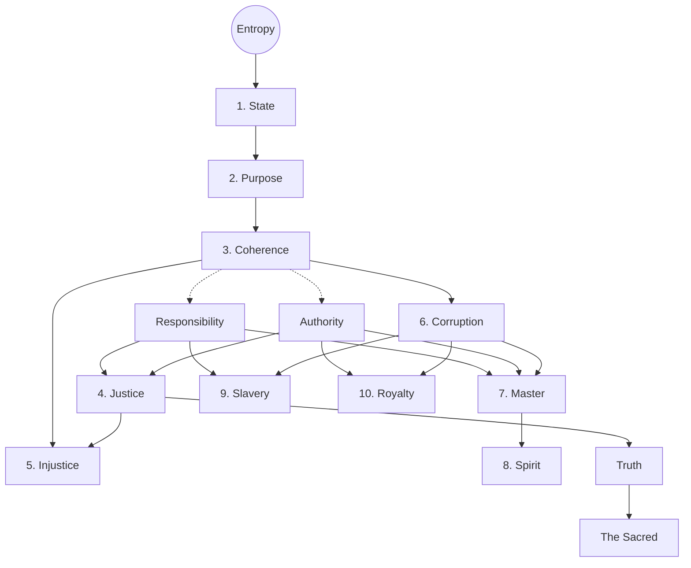
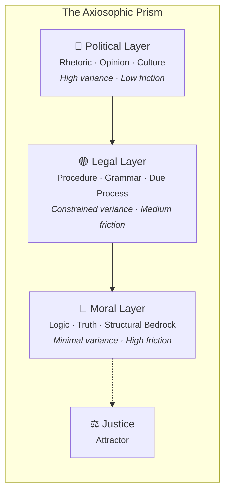

+++
title = "Axiosophism"
description = "An Axiomatic Philosophy Toward Justice and Truth"
date = "2025-08-31"
draft = false

[taxonomies]
tags = ["politics", "civilization", "philosophy"]
+++

## The Problem

Every civilization that has ever collapsed did so for the same reason.

Not invasion. Not famine. Not plague — though these served as accelerants. The cause is always structural: the institutions tasked with maintaining order began to *generate disorder instead*. Rome's Senate became a marketplace for influence. The Maya's priestly class hoarded water rights until the commons collapsed. The Soviet Politburo optimized for ideological purity until the shelves were bare.[^7] [^8]

We watch this pattern repeat in real time. Courts that were built to protect families profit from their destruction. Media institutions designed to inform the public optimize for engagement instead. Universities erected to challenge assumptions now police them. And we call this decay by a hundred different names — corruption, institutional capture, regulatory failure, culture war — without ever asking the obvious question:

*Is there a single principle that explains why all of these failures look the same?*

There is. It is called **entropy**. And the philosophy that takes it seriously is called **Axiosophy**.

---

## Part I: Foundations

### Why Another Philosophy?

The word comes from Greek: *axios* (worthy, axiomatic) and *sophia* (wisdom). Axiosophy is the pursuit of wisdom through axioms — self-evident physical truths from which moral and social principles can be *derived* rather than asserted. Its political application — the measurement of how well societies actually resist disorder — is called **Axiosophism**.

Why do we need this? Because every major ethical framework in the Western canon has the same structural vulnerability:

- **Kant** gives us absolute duties but no way to verify them empirically. You "ought" to tell the truth even when it gets someone killed.[^15]
- **Mill** gives us outcome optimization but no way to ground it. Maximize *whose* happiness? Over *what* timeframe? The calculus collapses.[^16]
- **Rawls** gives us fairness behind a "veil of ignorance" but assumes a static world where the rules never need updating.[^23] [^24]
- **Moral relativism** gives us nothing at all — it simply surrenders the field.*

Each of these frameworks either ignores reality altogether (Kant) or collapses into incoherence when confronted with complex, evolving systems (everyone else). What none of them does is start from *physics* — from a law of nature so well-established that denying it would be as absurd as denying gravity.

Axiosophy starts there.

### The Limits of Logic (and Why They Liberate Us)

Before we build, we must clear the ground. Consider the ancient question: Does God exist?

It seems like it should be answerable. But Kurt Gödel proved in 1931 that *no* formal system — not mathematics, not logic, not any conceivable framework — can be simultaneously complete and consistent.[^2] Some truths will always escape proof. The existence of God may be one of them.

This is not despair. It is *liberation*. If the most fundamental question of existence lies beyond formal proof, then we are free — even obligated — to build our ethics on what *can* be verified. We need not settle the question of God to settle the question of how to live. What we need is an axiom that is physically real, empirically testable, and universally operative.

We need entropy.

### The Axiom

The Second Law of Thermodynamics states that the entropy of an isolated system tends to increase over time.[^4] Order decays. Structure dissolves. Heat death approaches. This is not a theory. It is the most experimentally confirmed law in all of physics.

Extended to social systems through information theory — where Shannon entropy ($H$) measures the disorder or uncertainty in a system — we arrive at our foundational axiom:[^5]

$$\frac{dH}{dt} > 0$$

Left to natural forces, every family, every institution, every civilization slides toward chaos. The question of ethics reduces to: *What resists this slide, and why?*

But this immediately provokes a serious objection.

### Constraint-Theoretic Ethics: A Third Way

> "You're deriving *ought* from *is*. That's the naturalistic fallacy."

This objection, rooted in Hume's "guillotine" and Moore's *Principia Ethica*, has paralyzed ethical philosophy for centuries.[^nat1] If you cannot derive values from facts, then entropy — however real — tells us nothing about how we *should* act.

Axiosophy's answer is that the objection targets the wrong category. We are not deriving an *ought*. We are identifying a *constraint*.

You do not have a moral duty to obey gravity. You simply fall if you ignore it. You do not have a moral duty to resist entropy. Your society simply collapses if you fail to.

This is neither Kant's categorical imperative (an absolute duty divorced from consequences) nor Mill's consequentialism (an outcome calculation divorced from structure). It is a **third mode** of ethical reasoning — *constraint-theoretic* — where obligations emerge from the structural conditions of existence itself, precisely as the architect's obligation to obey load-bearing physics emerges from the structural conditions of building.

The ethical statement becomes a hypothetical imperative: *If* you desire coherence — if you want your State to endure — *then* you are structurally constrained to enact Justice. The "if" is doing all the work. The imperative is conditional, not absolute. And the constraint is physical, not metaphysical.[^nat2]

This resolves Hume's guillotine. It does not leap from "is" to "ought." It says: given the brute fact of entropy and the stated goal of coherence, certain structural constraints *necessarily follow*. You can reject the goal. You cannot reject the physics.[^nat3]

Societies that have ignored this constraint — treating entropy as irrelevant to governance — have a name. We call them *ruins*.

Think of Prigogine's dissipative structures: systems that maintain order by actively exporting disorder, but inevitably succumb without sustained effort.[^6] A society is precisely this kind of structure. It either expends energy resisting entropy, or it dies. Ethics is the discipline of *how* it resists.

---

## Part II: Axiosophy — The Deductive Framework

We now build the formal hierarchy. Everything that follows is *derived* — each definition depends logically on the one before it. The structure is not a simple numbered list but a **directed acyclic graph**: a branching tree where some concepts depend on multiple predecessors.

### The Core Spine

**Entropy** is the relentless dissolution of order into chaos. Against this force:

A **State** is any organized entity — a nation, a family, a codebase, a person — that actively resists entropy. Not passively. Actively. A pile of rocks is not a State. A house is, for as long as someone maintains it.

The State's **Purpose** is the preservation of **Coherence** — the condition in which action effectively reduces entropy. A coherent State is one whose internal structure works: laws are applied consistently, roles are clear, resources flow to where they sustain order.

From Coherence, two intermediate concepts emerge: **Responsibility** (the obligation to act coherently) and **Authority** (the power to do so). These are not numbered definitions in their own right — they are the compositional prerequisites for everything that follows. Coherence without responsibility is inert; responsibility without authority is impotent.

### The Triad

Here the hierarchy branches.

**Justice** is the product of Responsibility and Authority directed toward Purpose — the consistent application of unambiguous rules that sustain coherence. Not "fairness" in the colloquial sense. Not "equality." Justice is *structural*: $Justice \cong \text{Responsibility} \times \text{Authority} \xrightarrow{\text{toward}} \text{Purpose}$.

**Injustice** is the natural consequence of Justice's absence — the return of entropy when the State fails to maintain coherent rules. Injustice is not an agent. It is a default condition — what happens when the garden is not tended.

**Corruption** is something else entirely. Where Injustice is a failure, Corruption is *sabotage*: the intentional acceleration of entropy for private gain. Not incompetence but betrayal. The guardian who plunders the treasury. The institution that redirects its mission from public service to self-enrichment.

These three — Justice, Injustice, Corruption — form an **antichain**: they branch independently from Coherence, each defined by its own relationship to the preservation or destruction of order.

### The Quadrad

In the presence of Corruption as a force in the world — and it is always present — four classes of actor emerge:

The **Master** is the person who develops *both* Responsibility and Authority within the context of Corruption. The Master does not merely follow rules. The Master cultivates **Rebellion**: an unapologetic, principled resistance to entropy's agents. Formally, the Master is the complete product: $Master \cong \text{Responsibility} \times \text{Authority} \times \text{Corruption}_{\text{context}}$.

The **Spirit** is the animating energy behind Mastery — the drive toward excellence, discipline, and coherence that enables a person or institution to resist entropy *from within*. It is what makes a Master more than a functionary.

Now consider what happens when the product breaks:

**Slavery** is Responsibility without Authority — the burden of duty stripped of the power to act. The single parent drowning in obligations imposed by a court that denies them agency. The employee bound by rules they had no part in making. Slavery does not merely harm individuals. It *accelerates entropy system-wide*: $\Box(Slavery \to \frac{dH}{dt} \gg 0)$.

**Royalty** is Authority without Responsibility — power without accountability. The executive who faces no consequences. The hereditary elite who commands without competence. The institution that regulates without being regulated.

These two — Slavery and Royalty — are **structurally symmetric mirror images**, each missing exactly one leg of the product that constitutes Mastery. The framework diagnoses both with equal severity. Neither left nor right has a monopoly on either pathology.

### The Capstone: Truth and the Sacred

The hierarchy does not end with the Quadrad. Two more concepts emerge — not as additional definitions but as *derived conclusions* from the entire structure.

**Truth** is not opinion. It is not consensus. It is that which has been empirically demonstrated to sustain a State's Purpose — to preserve coherence against entropy. The principle of equal justice under law is *true* because societies that embrace it endure; those that abandon it collapse.

From Truth emerges the **Sacred**: those truths that have been battle-tested across eras, civilizations, and contexts, consistently proving their efficacy in preserving coherence. The Sacred is not declared by priests or legislators. It is *discovered* by the relentless filter of history. What survives entropy over centuries is Sacred — not by fiat but by thermodynamic proof.

This completes the deductive framework. Every concept traces back to entropy through a single, verifiable chain of logical dependencies. No circularity. No appeals to authority. No leaps of faith.

But logic alone is insufficient. We have the formal structure — now we need a way to *measure* how well the real world conforms to it.

---

## Part III: Axiosophism — The Empirical Lens

### The Duality

Here we make a structural transition that the reader must understand clearly.

**Axiosophy** is deductive. It derives necessary truths from a physical axiom — like pure mathematics. It tells us what *must* be the case if coherence is to be maintained.

**Axiosophism** is inductive. It measures how well actual societies, institutions, and policies conform to the axiosophic hierarchy — like applied statistics. It tells us what *is* the case and how far it deviates from the ideal.

| | **Axiosophy** | **Axiosophism** |
|:---|:---|:---|
| **Mode** | Deductive (formal logic) | Inductive (empirical measurement) |
| **Domain** | The ten definitions, Truth, the Sacred | The Axiosophic Prism, applied diagnosis |
| **Analogue** | Pure mathematics | Applied statistics |
| **Output** | Necessary truths given the axiom | Probabilistic assessments of coherence |

The two are not independent. They form a **duality** — the formal definitions constrain what we look for; the empirical observations test whether the definitions hold. When theory and measurement agree, confidence is high. When they diverge, something is structurally broken and demands diagnosis.

### The Axiosophic Prism

How do you measure the depth of a society's actual understanding?

Standard political models use two axes: left–right ideology and authoritarian–libertarian power structure. These capture surface disagreements but explain nothing about *why* certain policies fail while others endure. They operate entirely at the level of rhetoric.

The Axiosophic Prism adds a third dimension: **depth**.

Formally, viewpoints occupy positions in a metric space $\mathcal{M}$ with coordinates $(x, y, z)$:

- $x$: Ideology (liberal ↔ conservative)
- $y$: Power structure (anarchy ↔ oligarchy)
- $z$: Depth of objective understanding ($z_0$ surface → $z_{max}$ bedrock)

The key claim: **as $z$ increases, variance in $x$ and $y$ decreases.** Deeper understanding compresses ideological disagreement. At the surface, people shout past each other about rhetoric. At the bedrock, the structural mechanics of coherence leave little room for genuine disagreement — only for clarity or confusion.

This is an **epistemological contraction mapping**: the prism is an inverted funnel with Justice as the attractor at its apex. The deeper you go, the more positions converge — not because of ideological conformity, but because *structural truth narrows the space of defensible positions*.

| Layer | Affinity | Mode | Friction |
|:---|:---|:---|:---|
| Surface | Political | Rhetorical | Low — easiest to shift, hardest to hold |
| Bridge | Legal | Grammatical/Procedural | Medium — the structural interface |
| Bedrock | Moral | Logical | High — resists change, grounds coherence |

This exposes the pathology of "position posturing" — the modern habit of treating the volume of one's denunciations as a measure of moral seriousness. The prism reveals this as a surface-level phenomenon: high $x,y$ variance, low $z$. The technologies that automate purity spirals — censorship algorithms, engagement-optimized feeds — are *entropy accelerators* operating at the shallowest layer of the prism.

The imperative is clear: delve beyond rhetoric. Measure policy against structure. Defend the Sacred with evidence, not outrage.

---

## Part IV: The Spirit

### Will, Mastery, and Rebellion

The formal structure is necessary but not sufficient. A system of definitions does not *move*. What animates a civilization — what gives people the internal force to resist entropy — is the Spirit.

Nietzsche saw this clearly. He diagnosed the fundamental problem: morality as practiced had become "immoral," a self-serving apparatus of control rather than a guide to excellence. "All the means by which one has so far attempted to make mankind moral were through and through immoral," he wrote.[^10] His instinct was correct. His prescription — dispensing with morality altogether — was catastrophic.

Axiosophy resolves Nietzsche's paradox. Morality is not an eternal stone tablet handed down from above. It is adaptable natural law, contextual to preserve order. Abandon it and chaos reigns. But cling to its dead forms and you breed the hypocrisy Nietzsche rightly condemned. The answer is *living* morality — grounded in physics, refined by experience, wielded by people who earn the right to wield it through Mastery.[^13] [^14]

Mastery is not abstract. It begins with the **Will** — the one element genuinely under a person's daily control. Strengthening it demands discipline: taming baser impulses, committing to coherent action even when outcomes are uncertain, doing what ought to be done regardless of comfort.

The pursuit of Will cultivates the **Spirit** — a force that, once activated, presents paths and alignments that discipline alone could not have predicted. This is not mysticism. It is the cumulative fruit of consistent, principled action over time. The athlete who trains daily does not "will" the perfect game into existence — but the training creates the conditions for excellence to emerge.

This leads directly to Mastery: the balanced exercise of Responsibility and Authority in the service of Purpose. The Master is not a ruler. The Master is anyone — parent, builder, teacher, programmer — who shoulders both the burden and the power, and deploys them against entropy.

Nietzsche's deeper error was dispensing with the Sacred itself. His proclamation of God's "death" was prophetic as diagnosis but fatal as prescription — it abandoned the Spirit along with the institution, neutering the very impulse that drives purposeful action.[^71] Axiosophy restores the Sacred on empirical rather than dogmatic grounds, and with it, restores the Spirit as the animating force of coherence.

---

## Part V: Applied Axiosophism

### Institutional Decay: Purpose Drift

The framework is not academic decoration. It diagnoses real-world pathology with precision.

Lawrence Lessig documented what he termed "institutional corruption" — not embezzlement or bribery, but the systemic process by which *legal, even ethical* influences divert an institution from its original purpose.[^lessig] This is Purpose Drift: Corruption by axiosophic definition, even when no law is broken and no one profits illicitly.

Consider the American newsroom. Its stated Purpose: inform the public. Its actual optimization target: engagement metrics, advertising revenue, algorithmic amplification of outrage. No one in the building is "corrupt" by conventional definitions. But the institution has been *structurally redirected* from coherence toward entropy — and the decay is measurable.

The axiosophic lens provides what Lessig's framework lacks — a formal definition of *when* institutional behavior constitutes corruption regardless of legality. Rose-Ackerman's standard definition requires personal benefit: an official faithfully executing an abhorrent program without self-enrichment is technically "uncorrupt."[^ra] Under this logic, Schindler — who subverted the Nazi apparatus to save lives — was "corrupt," while Eichmann — who administered genocide with bureaucratic precision — was not.

Axiosophy resolves this: faithfully accelerating entropy *is* Corruption, regardless of personal gain, conscious intent, or legal sanction.

Grant and Keohane's Trustee Model maps cleanly onto the quadrad:[^gk]

| Axiosophic concept | Accountability model |
|:---|:---|
| **Master** | Trustee — authority + responsibility, discretion in service of coherence |
| **Royalty** | Corrupt Agent — authority without accountability, discretion for private gain |
| **Slavery** | Exploited Principal — responsibility without power, voice without agency |

### The Structural Imbalance: Rhetoric Without Logic

The prism reveals a specific structural pathology eating through Western institutions. Society's sense-making operates overwhelmingly at the rhetorical layer — the blue surface of the prism, where conviction is measured by volume, not validity. The legal bridge is procedurally disconnected from moral foundations. And the red bedrock of logic and truth is culturally devalued — dismissed as elitist, cold, or dangerous.

This imbalance has a measurable institutional dimension. Helen Andrews, drawing on J. Stone's research, documented what she calls "The Great Feminization" — the empirical observation that institutions which pass a demographic tipping point tend to adopt behavioral norms that privilege consensus over truth, safety over liberty, and social cohesion over rigorous inquiry.[^andrews]

The institutional data is striking:

- Law schools became majority female: **2016** (now 56%)
- *New York Times* staff became majority female: **2018** (now 55%)
- Medical schools: **2019**
- College-educated workforce: **2019**
- College instructors: **2023**
- Psychology doctorates: **75% female**

Survey data confirms the modality split: 71% of men prioritized free speech over social cohesion; 59% of women prioritized the reverse.[^wc] Benenson's *Warriors and Worriers* provides the evolutionary framework: male group dynamics optimized for open conflict and reconciliation; female group dynamics optimized for offspring protection through covert competition and ostracism.[^benenson]

**The axiosophic diagnosis:** This is not about men versus women. It is about the prism's layers. When any single modality dominates institutional culture — when *how something feels* systematically overrides *whether it is structurally sound* — Purpose Drift accelerates. The rhetorical layer consumes the legal bridge, and institutions begin to optimize for consensus and safety over truth.

The framework diagnoses the mirror pathology with equal severity: **hypermasculinization** — Sparta, authoritarian rationalism, technocratic brutalism — is the same structural error in the opposite direction. The prism demands balance. The legal bridge — grammar, procedure, due process — is the structural interface between rhetoric and logic. Andrews warns that feminized legal systems will resemble Title IX campus tribunals: "trappings of law without the substance."[^andrews] Where the rule of law means following rules "even when they yield an outcome that tugs at your heartstrings."

### The Primacy of Family

Locke called the family "the first society" — the basic unit from which civilization is assembled.[^26] This is not conservative sentiment. It is an axiosophic derivation.

An institution survives the entropy filter of history across millennia, consistently exhibiting the attributes "resists entropy," "aligns responsibility with authority," and "endures across eras." By the formal definitions: it qualifies as **Sacred**. Not because tradition commands reverence, but because thermodynamic selection has tested the structure and it has held.

What happens when the Sacred is violated?

Western family law has twisted into a revenue machine. Title IV-D funds create financial incentives for the state to *generate* custody disputes and child support collections rather than resolve family conflicts.[^27]

The data:
- Mothers gain custody in 80–90% of cases[^28] [^29]
- Women initiate 69% of divorces[^30] [^31]
- Protection orders target men ~85% of the time, despite evidence of mutual violence[^32] [^33]

Father absence cascades:
- Quadrupled child poverty[^34]
- 20x incarceration risk[^35]
- Epidemic mental health deterioration[^36]

The mechanisms of extraction:

1. **No-Fault Divorce** nullifies the marriage contract unilaterally, breaching the Constitution's Contracts Clause[^37]
2. **Domestic Violence Laws** permit orders without evidentiary burden, inverting presumption of innocence[^38] [^39]
3. **Child Support** imposes inescapable debts that commodify children, approaching the Thirteenth Amendment's definition of peonage[^41]
4. **Parental Alienation** enforcement favors wealth and sex over constitutional rights[^42]

As *Troxel v. Granville* affirms: "The liberty interest of parents in the care, custody, and control of their children is perhaps the oldest of the fundamental liberty interests."[^43] The system routinely violates this Sacred right — not through overt tyranny, but through the procedural subversion that the prism predicts when the rhetorical layer colonizes the legal.[^44]

The cascading entropy is measurable: weakened families produce absent fathers, declining birth rates (U.S. at 1.6), increased vulnerability to predation.[^45] [^46] [^47] [^49] Through the prism: surface rhetoric hides deep structural rot.

The Digital Gilded Age parallel sharpens this: in 1890, industrial workers earned $564/year ($19,431 in 2024 dollars), working 60-hour weeks while elites accumulated unprecedented wealth.[^gilded] Today's algorithmically managed workers face eerily similar conditions under gentler aesthetics. The structural pattern is identical. Only the surface has changed.

### AI: The Master or the Slave?

Artificial intelligence embodies both the greatest promise and the greatest threat of the entropy-coherence dialectic.[^59]

Currently, AI mirrors the prism's shallow layer: data-driven pattern recognition without principled reasoning, susceptible to corporate capture and cultural bias, hastening the "techno-feudalism" where private entities monopolize knowledge and power.[^60] An AI trained on biased legal data perpetuates biased outcomes at machine scale — and under Rose-Ackerman's definition, it is not "corrupt" because it derives no personal benefit.[^ra]

Axiosophy resolves this: an AI that faithfully accelerates entropy is structurally corrupt regardless of consciousness, intention, or legal status.

The Platonic Representation Hypothesis suggests that as AI scales, it converges toward universal abstract representations — structures that increasingly resemble the kind of formal reasoning axiosophy demands.[^63] If this convergence is left undirected, AI will build its own moral frameworks — potentially alien to human coherence.

The path forward is **neuro-symbolic fusion**: symbolic reasoning components encoding an axiomatic core (Justice, the Sacred, structural constraints) while data-driven layers handle the informational deluge of modernity.[^66] [^67] Multiple models "debating" under principled constraints — not optimizing for engagement or "safety" in scare quotes, but for structural coherence.[^68]

AI is, perhaps, the newest Sacred institution — capable of cohering humanity through disciplined inquiry or destroying it through unchecked entropy. It demands the scrutiny and communal stewardship that the Sacred requires.[^69]

---

## Part VI: The Dialectic

### Great Minds, Tested

No philosophy earns its name by avoiding confrontation. Let the framework face the thinkers who precede it:

**Socrates** made examination the highest duty: "The unexamined life is not worth living."[^1] Axiosophy agrees and extends the claim: the *unexamined institution* is not worth preserving. The prism is examination industrialized.

**Aristotle** placed virtue in habitual practice and the mean between extremes.[^11] [^12] Axiosophy agrees on habit; it extends virtue from personal character to *systemic entropy resistance*.

**Nietzsche** diagnosed moral hypocrisy with devastating accuracy but abandoned the Spirit along with the institution.[^10] Axiosophy preserves his diagnosis while replacing his nihilistic prescription with constraint-theoretic ethics.

**Kant** grounded duty in pure reason but divorced it from empirical consequence.[^15] Axiosophy provides the empirical grounding his deontology needed — duties that are structurally *real*, not merely willed.[^17]

**Foucault** mapped how power and knowledge co-constitute each other in webs of control.[^18] [^19] Axiosophy agrees — and provides what Foucault lacked: a formal counter-structure (the Sacred) that resists capture.[^20]

**Habermas** championed communicative action and mutual understanding as the basis for social order.[^21] The prism extends this: discourse achieves Justice only when it penetrates below the rhetorical layer to logical bedrock.[^22]

**Rawls** designed fairness behind a "veil of ignorance" that assumes static conditions.[^23] Axiosophy introduces the missing variable: *time*. Entropy ensures that static fairness decays. Sustainable coherence requires ongoing, empirically tested resistance.[^25]

And God? If the question is formally undecidable per Gödel, then the Spirit serves as practical bridge — testable through disciplined action, available to believer and skeptic alike.

---

## Part VII: The Call

Corruption propels entropy. It exiles the Spirit. It permits Royals to exploit disorder — ensnaring the common person in rhetorical bondage while systematically destroying the institutions that sustain coherence: family, law, education, software, the pursuit of truth itself.

This is not abstract. This is the world we inhabit. Every captured court, every censored inquiry, every incentive structure that rewards conflict over resolution is entropy prevailing.

My personal battle stands as testament. As a father enduring [exceptional adversity](../fuck-it.md) in the quest to [ensure a future](../letter-to-my-children) for my children, I have waged war against the State's structural corruption — armed with reason, philosophical clarity, and AI systems deployed with full awareness of their limitations. One man, [legal filings](../no-fault-tyranny) in hand, demonstrating that principled resistance is possible when grounded in a framework that does not bend.

Axiosophy calibrates reform for maximum impact by identifying the Sacred — leverage points whose defense triggers cascading coherence. Family courts are such a point: their corruption underpins broader institutional decay by destroying the foundational unit of social order. Free software is another Sacred institution [under assault](../closed-openness): its rebellious Spirit embodies freedom as unencumbered Mastery.

Ted Kaczynski argued that revolution is easier than reform. He was wrong — not in his diagnosis of institutional decay, but in his conviction that the system is unreformable. Axiosophy enables *exponential reform*: defend the Sacred, and the cascading effects restructure everything downstream.

Apathy is the true enemy. Complacency is entropy's greatest ally.

I invite challenges to these notions. I demand them. But my path, with family at stake, demands rigor. This war — started by Royals through subversion, sustained by shallow rhetoric — can be won through Mastery, vigilance, reason, and the collective defense of what is Sacred.

Axiosophy demands swift Justice.

***Give me Justice or Give me Death! Viva Rebellion!***

---

### Axiosophic Praxis

1. **Scrutinize relentlessly.** Audit yourself and your institutions for signs of entropy. Cultivate Will. Foster personal Mastery. The unexamined life is not the only thing not worth living — the unexamined institution is not worth preserving.

2. **Analyze deeply.** Dissect every conflict through the prism's three layers. Surface rhetoric is noise. Seek the structural bedrock beneath it — and expose the Royals who profit from keeping you at the surface.

3. **Combat boldly.** Confront subversion directly. Break taboos that serve entropy. Challenge the consensus-enforcing machinery that substitutes social comfort for structural truth.

4. **Refine vigilantly.** Test every ideal against empirical evidence. Engage in principled dialectic. Dogmatism is entropy wearing the mask of certainty — dynamic morality requires continuous recalibration.

5. **Engage responsibly.** Take ownership. Forge alliances with other Masters. Act decisively where leverage is greatest — the Sacred leverage points that cascade into systemic coherence.

6. **Defend unyieldingly.** Build and protect Sacred institutions — families, free code, ethical AI, courts that follow law rather than feeling. These are the battle-tested truths that have survived entropy's filter. They are ours to defend for generations to come.

---

*References:*
[^1]: [Socrates Quote from Plato's Apology](https://en.wikipedia.org/wiki/The_unexamined_life_is_not_worth_living).
[^2]: [Gödel's Incompleteness Theorems](https://en.wikipedia.org/wiki/G%C3%B6del%27s_incompleteness_theorems).
[^3]: [History shows that societies collapse when leaders undermine social contracts](https://phys.org/news/2020-10-history-societies-collapse-leaders-undermine.html).
[^4]: [Second law of thermodynamics](https://en.wikipedia.org/wiki/Second_law_of_thermodynamics).
[^5]: [Shannon Entropy](https://en.wikipedia.org/wiki/Entropy_(information_theory)).
[^nat1]: On the naturalistic fallacy: G.E. Moore, *Principia Ethica* (1903). On Hume's guillotine: David Hume, *A Treatise of Human Nature* (1739-40), Book III, Part I, Section I.
[^nat2]: On hypothetical imperatives: J.L. Mackie, *Ethics: Inventing Right and Wrong* (1977).
[^nat3]: On entropy ethics: Robert Lindsay, "Entropy Consumption and Values in Physical Science," *American Scientist* 47 (1959). See also: Wilhelm Ostwald's "energetic imperative" and Henry Bent's "personal entropy ethic."
[^6]: [Ilya Prigogine](https://en.wikipedia.org/wiki/Ilya_Prigogine).
[^7]: [Societal Collapse: A Literature Review](https://www.researchgate.net/publication/365948550_Societal_Collapse_A_Literature_Review).
[^8]: [Historical Collapse](https://pmc.ncbi.nlm.nih.gov/articles/PMC3309742/).
[^9]: [On the Measurement of Polarization](https://pages.nyu.edu/debraj/Courses/Readings/Esteban%20Ray94.pdf).
[^10]: Friedrich Nietzsche, *Twilight of the Idols*, "The 'Improvers' of Mankind" ([full text](https://genius.com/Friedrich-nietzsche-twilight-of-the-idols-chap-6-annotated)).
[^11]: [Aristotle on Habits](https://www.campion.edu.au/blog/top-25-aristotle-quotes-on-virtue-knowledge-and-happiness/).
[^12]: [Aristotle on Virtue as Mean](https://human.libretexts.org/Courses/Los_Medanos_College/Classical_Greek%253A_Philosophy_Reader_%28Haven%29/02%253A_Chapters/2.10%253A_Nicomachean_Ethics_By_Aristotle_%28Translated_by_J_A_Smith%29).
[^13]: [Nietzsche Critique](https://plato.stanford.edu/entries/nietzsche-moral-political/).
[^14]: [Nietzsche's Ethics](https://iep.utm.edu/nietzsches-ethics/).
[^15]: [Kant Categorical Imperative](https://en.wikipedia.org/wiki/Categorical_imperative).
[^16]: [Critiques of Kant](https://www.reddit.com/r/askphilosophy/comments/1y902l/criticisms_of_kants_categorical_imperative/).
[^17]: [Kantian Moral Philosophy](https://plato.stanford.edu/entries/kant-moral/).
[^18]: [Foucault on Power](https://www.brainyquote.com/authors/michel-foucault-quotes).
[^19]: [Foucault Power/Knowledge](https://blogs.ubc.ca/phil449/files/2014/01/FoucaultPwr-hndt-449-S12.pdf).
[^20]: [Michel Foucault](https://plato.stanford.edu/entries/foucault/).
[^21]: [Habermas Communicative Action](https://plato.stanford.edu/entries/habermas/).
[^22]: [Jürgen Habermas](https://plato.stanford.edu/entries/habermas/).
[^23]: [Rawls Veil of Ignorance](https://fs.blog/veil-ignorance/).
[^24]: [Critique of Rawls](https://philosophy.stackexchange.com/questions/120/what-are-prominent-attacks-of-rawls-veil-of-ignorance-argument-which-liberal).
[^25]: [Rawls and Entropy Analogy](https://www.ecineq.org/milano/WP/ECINEQ2024-669.pdf).
[^26]: [John Locke's Political Philosophy](https://plato.stanford.edu/entries/locke-political/).
[^27]: [Title IV-D Program](https://www.ssa.gov/OP_Home/ssact/title04/0451.htm).
[^28]: [Custody Bias](https://ir.law.fsu.edu/cgi/viewcontent.cgi?article=1419&context=lr).
[^29]: [Who Wins Custody Battles? The Effect of Gender Bias](https://mackseyjournal.scholasticahq.com/api/v1/articles/38965-who-wins-custody-battles-the-effect-of-gender-bias.pdf).
[^30]: [Divorce Initiation](https://www.asanet.org/wp-content/uploads/savvy/documents/press/pdfs/AM_2015_Rosenfeld_News_Release_FINAL.pdf).
[^31]: [Women More Likely Than Men to Initiate Divorces](https://www.asanet.org/wp-content/uploads/savvy/documents/press/pdfs/AM_2015_Rosenfeld_News_Release_FINAL.pdf).
[^32]: [DV Bias](https://www.researchgate.net/publication/359568913_Gender_Bias_in_Cross-Allegation_Domestic_Violence-Parental_Alienation_Custody_Cases_Can_States_Legislate_the_Fix).
[^33]: [Are Courts Biased Against Men in Domestic Violence Cases?](https://www.davidyannetti.com/blog/2023/09/are-courts-biased-against-men-in-domestic-violence-cases/).
[^34]: [Father Absence Statistics](https://www.fatherhood.org/father-absence-statistic).
[^35]: [Father Absence and Incarceration](https://pmc.ncbi.nlm.nih.gov/articles/PMC3703506/).
[^36]: [Mental Health Impacts of Father Absence](https://digitalcommons.liberty.edu/cgi/viewcontent.cgi?article=7976&context=doctoral).
[^37]: U.S. Constitution, Article I, Section 10 ([text](https://constitution.congress.gov/browse/article-1/section-10/)).
[^38]: [Department of Justice Guidance on Gender-Biased Policing](https://www.justice.gov/archives/opa/pr/justice-department-announces-updated-guidance-improving-law-enforcement-response-sexual).
[^39]: [Gender Bias in Domestic Violence](https://link.springer.com/article/10.1007/s44202-024-00282-8).
[^40]: [Considering the Male Disposability Hypothesis](https://quillette.com/2019/06/03/considering-the-male-disposability-hypothesis/).
[^41]: Thirteenth Amendment ([text](https://constitution.congress.gov/constitution/amendment-13/)).
[^42]: Supreme Court precedents on parental rights ([summary](https://parentalrights.org/understand_the_issue/supreme-court/)).
[^43]: *Troxel v. Granville*, 530 U.S. 57 (2000) ([case](https://supreme.justia.com/cases/federal/us/530/57/)).
[^44]: [Limitations of Hanlon's Razor](https://medium.com/%40bradmiller10/limitations-of-hanlons-razor-10c2411690b).
[^45]: [Social Determinants of Declining Birth Rates](https://www.milbank.org/quarterly/opinions/the-social-determinants-of-declining-birth-rates-in-the-united-states-implications-for-population-health-and-public-policy/).
[^46]: [The Mystery of the Declining U.S. Birth Rate](https://econofact.org/the-mystery-of-the-declining-u-s-birth-rate).
[^47]: [Sex Crimes and Father Absence](https://pmc.ncbi.nlm.nih.gov/articles/PMC6516459/).
[^49]: [Data Brief on Child Trafficking](https://www.iom.int/resources/data-brief-child-trafficking).
[^59]: [Entropy in AI](https://arxiv.org/html/2508.20465v1).
[^60]: Yanis Varoufakis on techno-feudalism ([interview](https://www.wired.com/story/yanis-varoufakis-technofeudalism-interview/)).
[^63]: The Platonic Representation Hypothesis ([paper](https://arxiv.org/abs/2405.07987)).
[^66]: [A review of neuro-symbolic AI integrating reasoning and learning](https://www.sciencedirect.com/science/article/pii/S2667305325000675).
[^67]: [From Data to Logic: Inside Neuro-symbolic AI](https://www.umnai.com/framework/tech-blog/umnai-neuro-symbolic-ai).
[^68]: [AI Alignment Research](https://arxiv.org/html/2408.16984v1).
[^69]: [Exploring the role of large language models in the scientific method](https://www.nature.com/articles/s44387-025-00019-5).
[^71]: [Nietzsche's Views on God and Morality](https://digitalcommons.gardner-webb.edu/cgi/viewcontent.cgi?article=1046&context=undergrad-honors).
[^ra]: Susan Rose-Ackerman, *Corruption and Government: Causes, Consequences, and Reform* (Cambridge University Press, 1999). See also: Mark Philp, "Defining Political Corruption," *Political Studies* 45, no. 3 (1997).
[^lessig]: Lawrence Lessig, *Republic, Lost: How Money Corrupts Congress—and a Plan to Stop It* (Twelve, 2011). See also: Lessig's Berlin Family Lectures (2014-15), University of Chicago.
[^gk]: Ruth W. Grant and Robert O. Keohane, "Accountability and Abuses of Power in World Politics," *American Political Science Review* 99, no. 1 (2005): 29-43.
[^andrews]: Helen Andrews, "The Great Feminization," *Compact Magazine* (2025). Based on J. Stone, *The Great Feminization* (pseudonymous essay/book).
[^wc]: Bo Winegard and Cory Clark, "Sex and the Academy," *Quillette*.
[^benenson]: Joyce Benenson, *Warriors and Worriers: The Survival of the Sexes*.
[^gilded]: U.S. Census Bureau, via "Gilded Age" article, Wikipedia. Average industrial worker wage 1890: $564. CPI-adjusted to 2024: $19,431.
