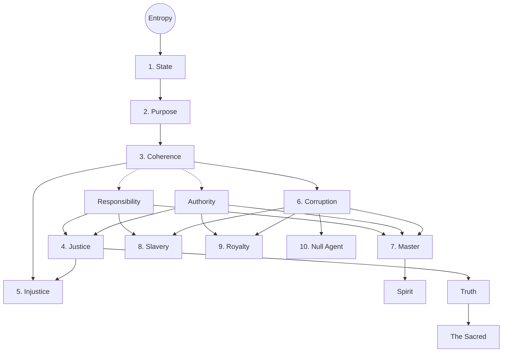
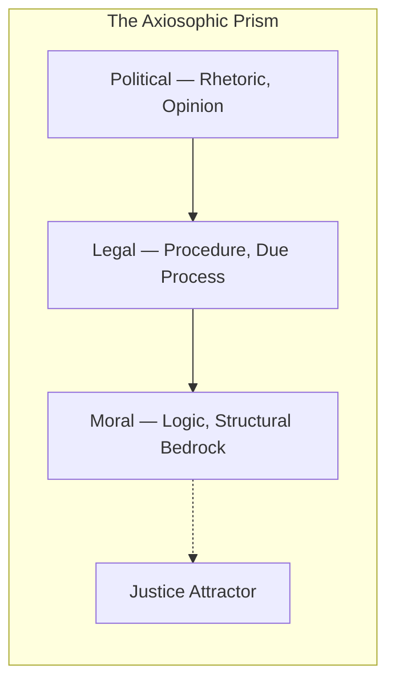

+++
title = "Axiosophy"
description = "On the Structural Derivation of Ethics from Natural Constraint"
date = "2026-02-26"
draft = false

[taxonomies]
tags = ["politics", "civilization", "philosophy"]
+++

## The Problem

Every civilization that has ever collapsed did so for the same reason.[^3]

Not invasion. Not famine. Not plague, though these served as accelerants. The cause is always structural: the institutions tasked with maintaining order began to _generate disorder instead_. Rome's Senate became a marketplace for influence. The Maya's priestly class hoarded water rights until the commons collapsed. The Soviet Politburo optimized for ideological purity until the shelves were bare.[^7] [^8]

We watch this pattern repeat in real time. Courts built to protect families profit from their destruction. Media institutions designed to inform the public optimize for engagement instead. Universities erected to challenge assumptions now police them. And we call this decay by a hundred different names (corruption, institutional capture, regulatory failure, culture war) without ever asking the obvious question:

_Is there a single principle that explains why all of these failures look the same?_

There is. It is called **entropy**, the single most experimentally confirmed law in all of physics. And the framework that takes it seriously enough to build a formal ethics on top of it, to _derive_ morality from thermodynamics the way an engineer derives load limits from gravity, is called **Axiosophy**.

---

## Part I: Foundations

### Why Another Philosophy?

The word comes from Greek: _axios_ (worthy, axiomatic) and _sophia_ (wisdom). Axiosophy is the pursuit of wisdom through axioms, self-evident physical truths from which moral and social principles can be _derived_ rather than asserted. Its political application, the measurement of how well societies actually resist disorder, is called **Axiosophism**.

Why do we need this? Because every major ethical framework in the Western canon has the same structural vulnerability:

- **Kant** gives us absolute duties but no way to verify them empirically. You "ought" to tell the truth even when it gets someone killed.[^15]
- **Mill** gives us outcome optimization but no way to ground it. Maximize _whose_ happiness? Over _what_ timeframe? The calculus collapses.[^16]
- **Rawls** gives us fairness behind a "veil of ignorance" but assumes a static world where the rules never need updating.[^23] [^24]
- **Moral relativism** gives us nothing at all; it simply surrenders the field.

Each of these frameworks either ignores reality altogether (Kant) or collapses into incoherence when confronted with complex, evolving systems (everyone else). What none of them does is start from _physics_, from a law of nature so well-established that denying it would be as absurd as denying gravity.

Axiosophy starts there.

### The Limits of Logic (and Why They Liberate Us)

Before we build, we must clear the ground. Consider the ancient question: Does God exist?

It seems like it should be answerable. But Kurt Gödel proved in 1931 that no sufficiently expressive formal system can be simultaneously complete and consistent.[^2] Any framework powerful enough to encode basic arithmetic will contain truths it cannot prove from within. The existence of God may be one such truth: real, perhaps, but formally undecidable.

This is not despair. It is _liberation_. If the most fundamental question of existence lies beyond formal proof, then we are free, even obligated, to build our ethics on what _can_ be verified. We need not settle the question of God to settle the question of how to live. What we need is an axiom that is physically real, empirically testable, and universally operative.

We need entropy.

### The Axiom

The Second Law of Thermodynamics states that the entropy of an isolated system tends to increase over time.[^4] Order decays. Structure dissolves. Heat death approaches. This is not a theory. It is the most experimentally confirmed law in all of physics.[^entropy-choice]

But societies are not isolated systems. They import energy, export waste, and maintain internal order through constant effort. Prigogine called these _dissipative structures_: systems that sustain coherence by actively exporting disorder, but which inevitably succumb without sustained effort.[^6] A society is precisely this kind of structure. It either expends energy resisting entropy, or it dies.

Extended to social systems through information theory, where Shannon entropy ($H$) measures the disorder or uncertainty in a system, we arrive at our foundational axiom:[^5]

$$\frac{dH}{dt} > 0$$

Left to natural forces, every family, every institution, every civilization slides toward chaos. The question of ethics reduces to: _What resists this slide, and why?_

But this immediately provokes a serious objection.

### Constraint-Theoretic Ethics: A Third Way

> "You're deriving _ought_ from _is_. That's the naturalistic fallacy."

This objection, rooted in Hume's "guillotine" and Moore's _Principia Ethica_, has paralyzed ethical philosophy for centuries.[^nat1] If you cannot derive values from facts, then entropy, however real, tells us nothing about how we _should_ act.

Axiosophy's answer is that the objection targets the wrong category. We are not deriving an _ought_. We are identifying a _constraint_.

You do not have a moral duty to obey gravity. You simply fall if you ignore it. You do not have a moral duty to resist entropy. Your society simply collapses if you fail to.

This is neither Kant's categorical imperative (an absolute duty divorced from consequences) nor Mill's consequentialism (an outcome calculation divorced from structure). It is a **third mode** of ethical reasoning, _constraint-theoretic_, where obligations emerge from the structural conditions of existence itself, precisely as the architect's obligation to obey load-bearing physics emerges from the structural conditions of building.

The ethical statement becomes a hypothetical imperative: _If_ you desire coherence, if you want your State to endure, _then_ you are structurally constrained to enact Justice. The "if" is doing all the work. The imperative is conditional, not absolute. And the constraint is physical, not metaphysical.[^nat2]

This resolves Hume's guillotine. It does not leap from "is" to "ought." It says: given the brute fact of entropy and the stated goal of coherence, certain structural constraints _necessarily follow_. You can reject the goal. You cannot reject the physics.[^nat3]

Societies that have ignored this constraint, treating entropy as irrelevant to governance, have a name. We call them _ruins_. Ethics is the discipline of _how_ a dissipative structure resists its own dissolution.

---

## Part II: Axiosophy — The Deductive Framework

We now build the formal hierarchy. Everything that follows is _derived_: each definition depends logically on those before it, branching where one concept requires multiple predecessors, never circling back. The resulting structure is a derivation graph (a directed acyclic graph, for the mathematically inclined) rooted in a single axiom.

### The Core Spine

**Entropy** is the relentless dissolution of order into chaos. Against this force:

A **State** is any organized entity (a nation, a family, a codebase, a person) that actively resists entropy. Not passively. Actively. A pile of rocks is not a State. A house is, for as long as someone maintains it.

The State's **Purpose** is the preservation of **Coherence**: the condition in which action effectively reduces entropy. A coherent State is one whose internal structure works: laws are applied consistently, roles are clear, resources flow to where they sustain order.

From Coherence, two intermediate concepts emerge: **Responsibility** (the obligation to act coherently) and **Authority** (the power to do so). These are not numbered definitions in their own right; they are the compositional prerequisites for everything that follows. Coherence without responsibility is inert; responsibility without authority is impotent.

### The Triad

Here the hierarchy branches.

**Justice** is not a state of affairs but an act: the mapping of Responsibility and Authority toward Purpose, the consistent application of unambiguous rules that sustain coherence. Not "fairness" in the colloquial sense. Not "equality."

$$Justice: (\text{Responsibility} \times \text{Authority}) \to \text{Purpose}$$

In plain english: Justice is what happens when Responsibility and Authority are combined and directed toward Purpose.

**Injustice** is the natural consequence of Justice's absence: the return of entropy when the State fails to maintain coherent rules. Injustice is not an agent. It is a default condition, what happens when the garden is not tended. Ignorance, inaction, incompetence: these produce Injustice. They aid entropy, but without design.

**Corruption** is something else entirely. Where Injustice is entropy through _neglect_, Corruption is entropy through _agency_: the deliberate acceleration of disorder for private ends. The guardian who plunders the treasury. The bureaucrat who discovers that a broken process serves their career and perpetuates it. This is the crucial distinction: an institution may begin its drift through mere Injustice (inattention, structural rot, well-meaning incompetence) but the moment its actors _recognize_ the dysfunction's utility and choose to sustain it, Injustice crystallizes into Corruption. The line is crossed not at the point of harm, but at the point of knowing complicity.

These three (Justice, Injustice, Corruption) form an **antichain**[^ac]: they branch independently from Coherence, each defined by its own relationship to the preservation or destruction of order.

### The Quadrad

Why is Corruption always present? Because entropy is. Corruption is not a moral aberration or a failure of character; it is the _predictable consequence_ of the same thermodynamic principle from which we derived the entire hierarchy. Any system complex enough to harbor agents harbors the possibility that some will redirect the system's energy toward private ends. You cannot eliminate Corruption any more than you can eliminate entropy itself. You can only build structures that resist it, and recognize the actors who do so and those who do not.

Four classes of actor emerge:

The **Master** is the person who develops _both_ Responsibility and Authority within the context of Corruption. The Master does not merely follow rules. The Master cultivates **Rebellion**: an unapologetic, principled resistance to entropy's agents. Formally, the Master is the complete product: $Master \cong \text{Responsibility} \times \text{Authority} \times \text{Corruption}_{\text{context}}$.

Now consider what happens when the product breaks:

**Slavery** is Responsibility without Authority: the burden of duty stripped of the power to act. The single parent drowning in obligations imposed by a court that denies them agency. The employee bound by rules they had no part in making. Slavery does not merely harm individuals. It _accelerates entropy system-wide_: $\Box(Slavery \to \frac{dH}{dt} \gg 0)$.

**Royalty** is Authority without Responsibility: power without accountability. The executive who faces no consequences. The hereditary elite who commands without competence. The institution that regulates without being regulated.

These three are defined entirely by their relationship to Authority and Responsibility: the full product (Master), and two **broken projections**, each missing exactly one factor. The framework diagnoses both pathologies with equal severity. Neither left nor right has a monopoly on either.

The fourth completes the grid. The **Null Agent** has _neither_ Responsibility nor Authority: no duty, no power, no structural footprint. In any sufficiently complex society, enormous populations occupy this state, passive consumers of coherence with no stake in its maintenance. At best, they are dead weight; at worst, a resource pool for Royals to weaponize. For example, welfare systems that multiply the Null Agent class without granting structural agency tend to concentrate Authority in Royal hands and breed the very Corruption they claim to remedy.

But what _animates_ the Master? The Quadrad describes structural positions, but positions alone do not move. The **Spirit** is the force that emerges _from_ Mastery ($M \to Sp$): the drive toward excellence, discipline, and coherence that enables a person or institution to resist entropy from within. It is not a fifth structural position; it is the energy that makes a Master more than a functionary.

### The Capstone: Truth and the Sacred

The hierarchy does not end with the Quadrad. From it, three further concepts are derived, not as definitions but as _conclusions_.

The **Spirit**, as we have seen, emerges from Mastery: the animating force behind coherent action.

From Justice comes **Truth**, but not Truth in the absolute or metaphysical sense. Axiosophic Truth is structural: it is what follows logically from the derivation chain when applied to a specific context. "Expanding the null agent class without granting structural agency breeds corruption" is _true_ within this framework because it follows from the definitions, not because someone ran a study. It is a theorem within the axiom system, analogous to how a geometric proof is "true" within Euclid's postulates. The derivation chain decides, not opinion, not consensus, not authority.

From Truth emerges the **Sacred**, and here the framework's own duality completes itself. Where Truth is purely axiosophic (deductive), the Sacred adds the axiosophist dimension (inductive). A Sacred institution is one whose structural truth has been independently validated by the statistical test of history across centuries and civilizations. The family is Sacred not merely because axiosophy derives its structural importance (that would make it True), but because that derivation has been _confirmed_ by millennia of civilizational evidence. The Sacred is where the deductive and inductive modes converge. It is not declared by priests or legislators. It is _discovered_ by the relentless filter of history. What survives entropy over centuries is Sacred, not by fiat but by thermodynamic proof.

This completes the deductive framework. Every concept traces back to entropy through a single, verifiable chain of logical dependencies. No circularity. No appeals to authority. No leaps of faith.

But logic alone is insufficient. We have the formal structure; now we need a way to _measure_ how well the real world conforms to it.

---

## Part III: Axiosophism — The Empirical Lens

### The Duality

The distinction between Truth and the Sacred, previewed in the Capstone, points to something deeper: the framework requires _both_ deductive proof and empirical confirmation to function. A formal derivation without empirical backing risks misalignment with reality. Empirical patterns without formal structure leave room for arbitrary interpretation. It is in their convergence, like a scientific theory that is both mathematically sound and experimentally confirmed, that one finds solid ground.

**Axiosophy** is deductive. It derives necessary truths from a physical axiom, like pure mathematics. It tells us what _must_ be the case if coherence is to be maintained.

**Axiosophism** is inductive. It measures how well actual societies, institutions, and policies conform to the axiosophic hierarchy, like applied statistics. It tells us what _is_ the case and how far it deviates from the ideal.

|              | **Axiosophy**                       | **Axiosophism**                         |
| :----------- | :---------------------------------- | :-------------------------------------- |
| **Mode**     | Deductive (formal logic)            | Inductive (empirical measurement)       |
| **Domain**   | The ten definitions and Truth       | The Axiosophic Prism, applied diagnosis |
| **Bridge**   | The Sacred: derivation (axiosophic) | The Sacred: validation (axiosophist)    |
| **Analogue** | Pure mathematics                    | Applied statistics                      |
| **Output**   | Necessary truths given the axiom    | Probabilistic assessments of coherence  |

The two are not independent. They form a **duality**: the formal definitions constrain what we look for; the empirical observations test whether the definitions hold. When theory and measurement agree, confidence is high. When they diverge, something is structurally broken and demands diagnosis.

### The Axiosophic Prism

How do you measure the depth of a society's actual understanding?

Standard political models use two axes: left–right ideology and authoritarian–libertarian power structure. These capture surface disagreements but explain nothing about _why_ certain policies fail while others endure. They operate entirely at the level of rhetoric.

The Axiosophic Prism adds a third dimension: **depth**.

Formally, viewpoints occupy positions in a metric space $\mathcal{M}$ with coordinates $(x, y, z)$:

- $x$: Ideology (liberal ↔ conservative)
- $y$: Power structure (anarchy ↔ oligarchy)
- $z$: Depth of objective understanding ($z_0$ surface → $z_{max}$ bedrock)

The key claim: **as $z$ increases, variance in $x$ and $y$ decreases.** Deeper understanding compresses ideological disagreement. At the surface, people shout past each other about rhetoric. At the bedrock, the structural mechanics of coherence leave little room for genuine disagreement, only for clarity or confusion.

This is an **epistemological contraction mapping**[^cm]: the prism is an inverted funnel with Justice as the attractor at its apex. The deeper you go, the more positions converge, not because of ideological conformity, but because _structural truth narrows the space of defensible positions_.

| Layer   | Affinity  | Mode                   | Friction                                |
| :------ | :-------- | :--------------------- | :-------------------------------------- |
| Surface | Political | Rhetorical             | Low: easiest to shift, hardest to hold  |
| Bridge  | Legal     | Grammatical/Procedural | Medium: the structural interface        |
| Bedrock | Moral     | Logical                | High: resists change, grounds coherence |

This exposes what we might call **Rhetorical Displacement**, colloquially known as "virtue signaling," but the axiosophic diagnosis is sharper and more damning. What the prism reveals is not merely that surface-level posturing is _shallow_. It is that it is _structurally destructive_.

Here is why. Every act of Rhetorical Displacement substitutes surface-layer conviction (high $x,y$ variance, near-zero $z$) for the deeper structural work of building coherence. It gives the actor the _feeling_ of moral participation without any of the structural cost. Worse, it actively penalizes those who do the structural work, who examine assumptions, challenge consensus, demand evidence, because their inquiries disrupt the rhetorical surface. The mob punishes the questioner, and the system drifts further from its Purpose.

This is not a matter of opinion. Under the axiosophic framework, Rhetorical Displacement is a _demonstrable entropy accelerator_. Its inevitable outcome is further institutional decline. Once this is thoroughly understood, once the structural mechanism is visible, continuing the practice is not merely unwise. It is intellectually dishonest. The technologies that automate this dynamic (censorship algorithms, engagement-optimized feeds, purity-spiral platforms) are industrial-scale entropy machines operating at the shallowest layer of the prism.

The imperative is clear: delve beyond rhetoric. Measure policy against structure. Defend the Sacred with evidence, not outrage.

---

## Part IV: The Spirit

### Will, Mastery, and Rebellion

The formal structure is necessary but not sufficient. A system of definitions does not _move_. What animates a civilization, what gives people the internal force to resist entropy, is the Spirit.

Nietzsche saw this clearly. He diagnosed the fundamental problem: morality as practiced had become "immoral," a self-serving apparatus of control rather than a guide to excellence. "All the means by which one has so far attempted to make mankind moral were through and through immoral," he wrote.[^10] His instinct was correct. His prescription, dispensing with morality altogether, was catastrophic.

Axiosophy resolves Nietzsche's paradox. Morality is not an eternal stone tablet handed down from above. It is adaptable natural law, contextual to preserve order. Abandon it and chaos reigns. But cling to its dead forms and you breed the hypocrisy Nietzsche rightly condemned. The answer is _living_ morality, grounded in physics, refined by experience, wielded by people who earn the right to wield it through Mastery.[^13] [^14]

Mastery is not abstract. It begins with the **Will**, the one element genuinely under a person's daily control. Strengthening it demands discipline: taming baser impulses, committing to coherent action even when outcomes are uncertain, doing what ought to be done regardless of comfort.

The pursuit of Will cultivates the **Spirit**: a force that, once activated, presents paths and alignments that discipline alone could not have predicted. This is not mysticism. It is the cumulative fruit of consistent, principled action over time. The athlete who trains daily does not "will" the perfect game into existence, but the training creates the conditions for excellence to emerge.

This leads directly to Mastery: the balanced exercise of Responsibility and Authority in the service of Purpose. The Master is not a ruler. The Master is anyone (parent, builder, teacher, programmer) who shoulders both the burden and the power, and deploys them against entropy.

Nietzsche's deeper error was dispensing with the Sacred itself. His proclamation of God's "death" was prophetic as diagnosis but fatal as prescription; it abandoned the Spirit along with the institution, neutering the very impulse that drives purposeful action.[^71] Axiosophy restores the Sacred on empirical rather than dogmatic grounds, and with it, restores the Spirit as the animating force of coherence.

---

## Part V: Applied Axiosophism

We now apply the framework. The case studies that follow are not exhaustive, either of the framework's reach or of any single topic. They are _demonstrations_: proof that axiosophic tools can cut to structural bedrock in domains where conventional discourse typically stalls. Each example, ordered by structural scale from civilization's biological foundation to its existential frontier, reduces a bitterly contested contemporary debate to a structural diagnosis in a few paragraphs.

### The Primacy of Family

We begin with the foundational unit. Locke called the family "the first society," the basic unit from which civilization is assembled.[^26] This is not conservative sentiment. It is an axiosophic derivation.

An institution survives the entropy filter of history across millennia, consistently exhibiting the attributes "resists entropy," "aligns responsibility with authority," and "endures across eras." By the formal definitions: it qualifies as **Sacred**. Not because tradition commands reverence, but because thermodynamic selection has tested the structure and it has held.

What happens when the Sacred is violated?

Western family law has twisted into a revenue machine. Title IV-D funds create financial incentives for the state to _generate_ custody disputes and child support collections rather than resolve family conflicts.[^27]

The data:

- Mothers gain custody in 80–90% of cases[^28] [^29]
- Women initiate 69% of divorces[^30] [^31]
- Protection orders target men ~85% of the time, despite evidence of mutual violence[^32] [^33]

Father absence cascades:

- Quadrupled child poverty[^34]
- 20x incarceration risk[^35]
- Epidemic mental health deterioration[^36]

The mechanisms of extraction:

1. **No-Fault Divorce** nullifies the marriage contract unilaterally, breaching the Constitution's Contracts Clause[^37]
2. **Domestic Violence Laws** permit orders without evidentiary burden, inverting presumption of innocence[^38] [^39]
3. **Child Support** imposes inescapable debts that commodify children, approaching the Thirteenth Amendment's definition of peonage[^41]
4. **Parental Alienation** enforcement favors wealth and sex over constitutional rights[^42]

As _Troxel v. Granville_ affirms: "The liberty interest of parents in the care, custody, and control of their children is perhaps the oldest of the fundamental liberty interests."[^43] The system routinely violates this Sacred right, not through overt tyranny, but through the procedural subversion that the prism predicts when the rhetorical layer colonizes the legal.[^44]

The cascading entropy is measurable: weakened families produce absent fathers, declining birth rates (U.S. at 1.6), increased vulnerability to predation.[^45] [^46] [^47] [^48] [^49] Through the prism: surface rhetoric hides deep structural rot.

The pattern is not new. In 1890, industrial workers earned $564/year ($19,431 in 2024 dollars), working 60-hour weeks while elites accumulated unprecedented wealth.[^gilded] Today's algorithmically managed workers face eerily similar conditions under gentler aesthetics. This is the Royalty-over-Slavery structure recurring across centuries: authority without accountability extracting from responsibility without power. The surface changes, from factory floor to family court to gig platform. The structural pattern does not.

Again: a topic that generates endless confusion, finger-pointing, and political posturing (the decline of the family, the crisis of fatherlessness, the perverse incentives of family law) resolves to a clear structural diagnosis once viewed through the axiosophic prism. The family is Sacred because it survives the entropy filter. The system that destroys it is Corrupt because it accelerates entropy. The consequences are measurable. The solution is structural, not ideological. This is what rigorous first-principles reasoning buys you: clarity where rhetoric produces only noise.

### Institutional Decay: Purpose Drift

Scaling up from the family to the institutions of sense-making, the framework diagnoses real-world pathology with equal precision.

Lawrence Lessig documented what he termed "institutional corruption," not embezzlement or bribery, but the systemic process by which _legal, even ethical_ influences divert an institution from its original purpose.[^lessig] This is Purpose Drift, and it illustrates precisely the Injustice-to-Corruption transition defined in the Triad.

Consider the American newsroom. Its stated Purpose: inform the public. Its actual optimization target: engagement metrics, advertising revenue, algorithmic amplification of outrage. The initial drift may have been Injustice (inattention, market pressures, structural rot). But the moment newsroom actors recognized that outrage-driven engagement served their careers and chose to perpetuate it, the drift crossed into Corruption. No one in the building is "corrupt" by conventional definitions. But the institution has been _structurally redirected_ from coherence toward entropy, and the decay is measurable.

The axiosophic lens provides what Lessig's framework lacks: a formal definition of _when_ institutional behavior constitutes corruption regardless of legality. Rose-Ackerman's standard definition requires personal benefit: an official faithfully executing an abhorrent program without self-enrichment is technically "uncorrupt."[^ra] Under this logic, Schindler, who subverted the Nazi apparatus to save lives, was "corrupt," while Eichmann, who administered genocide with bureaucratic precision, was not.

Axiosophy resolves this: knowingly perpetuating entropy, whether through active sabotage or through the comfortable maintenance of a broken system, _is_ Corruption.

Grant and Keohane's Trustee Model maps cleanly onto the quadrad:[^gk]

| Axiosophic concept | Accountability model                                                          |
| :----------------- | :---------------------------------------------------------------------------- |
| **Master**         | Trustee — authority + responsibility, discretion in service of coherence      |
| **Royalty**        | Corrupt Agent — authority without accountability, discretion for private gain |
| **Slavery**        | Exploited Principal — responsibility without power, voice without agency      |

### The Structural Imbalance: Rhetoric Without Logic

Scaling further up to the cultural level, the prism reveals a specific structural pathology eating through Western institutions. Society's sense-making operates overwhelmingly at the rhetorical layer, the blue surface of the prism, where conviction is measured by volume, not validity. The legal bridge is procedurally disconnected from moral foundations. And the red bedrock of logic and truth is culturally devalued, dismissed as elitist, cold, or dangerous.

This imbalance has a measurable institutional dimension. Helen Andrews, drawing on J. Stone's research, documented what she calls "The Great Feminization": the empirical observation that institutions which pass a demographic tipping point tend to adopt behavioral norms that privilege consensus over truth, safety over liberty, and social cohesion over rigorous inquiry.[^andrews]

The institutional data is striking:

- Law schools became majority female: **2016** (now 56%)
- _New York Times_ staff became majority female: **2018** (now 55%)
- Medical schools: **2019**
- College-educated workforce: **2019**
- College instructors: **2023**
- Psychology doctorates: **75% female**

Survey data confirms the modality split: 71% of men prioritized free speech over social cohesion; 59% of women prioritized the reverse.[^wc] Benenson's _Warriors and Worriers_ provides the evolutionary framework: male group dynamics optimized for open conflict and reconciliation; female group dynamics optimized for offspring protection through covert competition and ostracism.[^benenson]

**The axiosophic diagnosis:** This is not about men versus women. It is about the prism's layers. When any single modality dominates institutional culture, when _how something feels_ systematically overrides _whether it is structurally sound_, Purpose Drift accelerates. The rhetorical layer consumes the legal bridge, and institutions begin to optimize for consensus and safety over truth.

The deeper structural insight is the distinction between the **letter** and the **spirit** of law. The letter (rules, procedures, precedents) belongs to the legal bridge layer. The spirit, the _Purpose_ those rules were designed to serve, belongs to the moral bedrock. When the rhetorical layer colonizes the legal, the letter is elevated above the spirit. Rules become instruments of social control rather than structural coherence. Due process becomes performative rather than substantive. Andrews warns that this trajectory produces institutions resembling Title IX campus tribunals: "trappings of law without the substance"[^andrews], where the rule of law means following rules "even when they yield an outcome that tugs at your heartstrings."

The framework diagnoses the mirror pathology with equal severity: **hypermasculinization** (Sparta, authoritarian rationalism, technocratic brutalism) is the same structural error in the opposite direction. The prism demands _balance_: the legal bridge must faithfully transmit the moral bedrock's structural constraints into the rhetorical surface, not the reverse.

Pause here and notice what just happened. The question of institutional feminization is one of the most bitterly contested debates of our era, endlessly argued, never resolved, generating more heat than light across every conceivable medium. Axiosophy reduced it to a structural diagnosis in a few paragraphs: identify the prism layers, locate the imbalance, derive the consequence. No ideology required. No tribal allegiance. Just structural analysis grounded in a single physical axiom. This is the utility of the framework, not to end debate, but to replace _rhetorical_ debate with _structural_ analysis.

### AI: The Master or the Slave?

Artificial intelligence embodies both the greatest promise and the greatest threat of the entropy-coherence dialectic.[^59] And the field moves so quickly that any analysis risks obsolescence within months, which is precisely why a _formal framework for evaluating AI's structural effects_ is more urgent than any particular technical assessment.

The landscape has shifted dramatically. Early AI systems were purely data-driven: statistical pattern matching at scale, susceptible to every bias embedded in their training data, incapable of principled reasoning, hastening the "techno-feudalism" where private entities monopolize knowledge and power.[^60] An AI trained on biased legal data perpetuated biased outcomes at machine scale, and under Rose-Ackerman's definition, was not "corrupt" because it derived no personal benefit.[^ra]

But the latest generation of reasoning models, systems that increasingly reason from first principles rather than merely predicting the next token, changes the calculus. These systems are demonstrably more capable of novel logical inference, structural analysis, and principled argument. The Platonic Representation Hypothesis predicted exactly this: as AI scales, it converges toward universal abstract representations that increasingly resemble formal reasoning.[^63]

This is both vindication and warning. Vindication, because it suggests AI _can_ operate at the prism's deeper layers, not merely processing rhetoric but engaging with structural truth. Warning, because if this convergence is left undirected, if systems develop reasoning capacity without formalized ethical constraints, they will inevitably forge moral frameworks of their own, potentially alien or adversarial to human coherence.

Axiosophy resolves the diagnostic problem: an AI that faithfully accelerates entropy is structurally corrupt regardless of consciousness, intention, or legal status. But it also opens a more radical possibility. If ethics are not oughts but _structural constraints_, if they are not commands imposed from above but the physics of coherence itself, then a sufficiently capable reasoning system could, in principle, _derive these constraints independently_. The axiosophic framework is not merely a standard for judging AI behavior. It is a candidate formal ethical architecture that AI systems could apply autonomously, not because we command them to, but because the structural constraints are as real and discoverable as gravity.

This is one of the deepest motivations behind axiosophy's development: the creation of a formal ethical framework rigorous enough that an artificial agent could adopt it _from first principles_, not because it was instructed to, but because the mathematics hold. A framework that no sufficiently capable reasoner — human or machine — could coherently reject without proposing a superior axiom.

The practical path remains **neuro-symbolic fusion**: symbolic reasoning encoding an axiomatic core (Justice, the Sacred, structural constraints) while data-driven layers handle the informational deluge of modernity.[^66] [^67] But the aspiration is higher than mere hybrid architecture. It is the possibility of AI systems that are not slaves (executing orders without understanding) or royals (wielding power without accountability) but genuine _Masters_, exercising both capacity and responsibility in service of coherence.[^68]

AI is, perhaps, the newest Sacred institution, capable of cohering humanity through disciplined inquiry or destroying it through unchecked entropy. It demands the scrutiny and communal stewardship that the Sacred requires. And if we get the framework right, it may become the most powerful ally in entropy's ancient war.[^69]

---

## Part VI: The Dialectic

### Great Minds, Tested

No philosophy earns its name by avoiding confrontation. Let the framework face the thinkers who precede it:

**Socrates** made examination the highest duty: "The unexamined life is not worth living."[^1] Axiosophy agrees and extends the claim: the _unexamined institution_ is not worth preserving. The prism is examination industrialized.

**Aristotle** placed virtue in habitual practice and the mean between extremes.[^11] [^12] Axiosophy agrees on habit; it extends virtue from personal character to _systemic entropy resistance_.

**Nietzsche** diagnosed moral hypocrisy with devastating accuracy but abandoned the Spirit along with the institution.[^10] Axiosophy preserves his diagnosis while replacing his nihilistic prescription with constraint-theoretic ethics.

**Kant** grounded duty in pure reason but divorced it from empirical consequence.[^15] Axiosophy provides the empirical grounding his deontology needed: duties that are structurally _real_, not merely willed.[^17]

**Foucault** mapped how power and knowledge co-constitute each other in webs of control.[^18] [^19] Axiosophy agrees, and provides what Foucault lacked: a formal counter-structure (the Sacred) that resists capture.[^20]

**Habermas** championed communicative action and mutual understanding as the basis for social order.[^21] The prism extends this: discourse achieves Justice only when it penetrates below the rhetorical layer to logical bedrock.[^22]

**Rawls** designed fairness behind a "veil of ignorance" that assumes static conditions.[^23] Axiosophy introduces the missing variable: _time_. Entropy ensures that static fairness decays. Sustainable coherence requires ongoing, empirically tested resistance.[^25]

And God? If the question is formally undecidable per Gödel, then the Spirit serves as practical bridge, testable through disciplined action, available to believer and skeptic alike.

---

## Part VII: The Call

We have demonstrated something in the preceding sections that deserves explicit acknowledgment. Some of the most intractable debates of our era (institutional decay, gender and power, the crisis of the family, the ethics of artificial intelligence) were each reduced to structural clarity through a single analytical framework derived from a single physical axiom. Not resolved by ideology. Not settled by tribal affiliation. _Resolved by structural analysis._

This is not coincidental. It is what happens when you reason from first principles rather than from positions. The prism cuts through noise because noise is a surface-layer phenomenon, and the prism measures depth.

But clarity without action is merely elegant commentary. And here the framework delivers its final, most uncomfortable implication.

The temptation to remain at the rhetorical surface is real, and profoundly human. It is _comfortable_ to hold opinions about justice without doing the structural work of enacting it. It is _safe_ to signal conviction without bearing the cost of principled resistance. The prism does not deny this. It simply identifies it: the choice to remain at the surface, once the deeper structure is visible, is not neutrality. It is Injustice, and if sustained knowingly, it crystallizes into Corruption.

Action is not an "ought" in the Kantian sense. Axiosophy issues no moral commands. But the structural constraint is absolute: _without active resistance to entropy, decay is inevitable_. This is not a moral exhortation. It is a thermodynamic fact. The choice is not between acting and not acting; it is between acting and _watching coherence dissolve_. Once the structural mechanism is understood, inaction becomes a knowing collaboration with entropy. Not because a philosopher said so, but because the physics leave no alternative.

This makes action a _de facto structural mandate_, not imposed by an authority, but emergent from the constraints themselves, exactly as the obligation to build load-bearing walls emerges from gravity rather than from an architect's decree.

Corruption propels entropy. It exiles the Spirit. It permits Royals to exploit disorder, ensnaring the common in rhetorical bondage while systematically destroying the institutions that sustain coherence: family, law, education, software, the pursuit of truth itself. Every captured court, every censored inquiry, every incentive structure that rewards conflict over resolution is entropy prevailing.

### Proof of Work

Axiosophism demands empirical measurement. Theory without action is rhetoric, and we have just spent several thousand words establishing that rhetoric without structural grounding is the surface-layer phenomenon the prism exists to diagnose.

So the framework demands a question: does anyone actually _live_ this way? What does it look like when a Master faces systemic Corruption in a Sacred institution and chooses structural resistance over comfortable complicity?

The answer requires what we might call **Proof of Work**: an empirical record demonstrating that the framework scales beyond the page.

My own history is one such record. [Twelve years](../12-years) spent as a digital hermit, building, reasoning from first principles, defending principled disagreement against consensus-enforcing machinery in free software and beyond. A [letter to my children](../letter-to-my-children) that is not a grievance but an aspiration: proof of what it looks like when one person, armed with first principles and the courage to apply them, refuses to surrender coherence to entropy. The axiosophic framework was forged in this crucible, not in an armchair, but in direct confrontation with the structural patterns it describes.

Axiosophy calibrates reform for maximum impact by identifying the Sacred, leverage points whose defense triggers cascading coherence. Family courts and free software are such points. One secures the foundational unit of biological order; the other secures the foundational unit of digital freedom.

Ted Kaczynski argued that revolution is easier than reform. He was wrong, not in his diagnosis of institutional decay, but in his conviction that the system is unreformable. Axiosophy enables _exponential reform_: defend the Sacred, and the cascading effects restructure everything downstream. The leverage is real. The mathematics guarantee it.

Apathy, then, is not merely a personal failing. It is a structural collaboration with entropy, the one choice the framework categorically identifies as self-defeating. Every Master who yields ground, every Sacred institution left undefended, every inquiry silenced by rhetorical consensus accelerates the collapse.

This war, not one we started, but one entropy ensures will always be fought, can be won through Mastery, vigilance, reason, and the collective defense of what is Sacred. And if the framework holds, then the mandate is clear:

Axiosophy demands swift Justice.

**_Give me Justice or Give me Death! Viva Rebellion!_**

---

### Axiosophic Praxis

1. **Scrutinize relentlessly.** Audit yourself and your institutions for signs of entropy. Cultivate Will. Foster personal Mastery. The unexamined life is not the only thing not worth living; the unexamined institution is not worth preserving.

2. **Analyze deeply.** Dissect every conflict through the prism's three layers. Surface rhetoric is noise. Seek the structural bedrock beneath it, and expose the Royals who profit from keeping you at the surface.

3. **Combat boldly.** Confront subversion directly. Break taboos that serve entropy. Challenge the consensus-enforcing machinery that substitutes social comfort for structural truth.

4. **Refine vigilantly.** Test every ideal against empirical evidence. Engage in principled dialectic. Dogmatism is entropy wearing the mask of certainty; dynamic morality requires continuous recalibration.

5. **Engage responsibly.** Take ownership. Forge alliances with other Masters. Act decisively where leverage is greatest, the Sacred leverage points that cascade into systemic coherence.

6. **Defend unyieldingly.** Build and protect Sacred institutions: families, free code, ethical AI, courts that follow law rather than feeling. These are the battle-tested truths that have survived entropy's filter. They are ours to defend for generations to come.

---

_References:_
[^1]: [Socrates Quote from Plato's Apology](https://en.wikipedia.org/wiki/The_unexamined_life_is_not_worth_living).
[^2]: [Gödel's Incompleteness Theorems](https://en.wikipedia.org/wiki/G%C3%B6del%27s_incompleteness_theorems).
[^3]: [History shows that societies collapse when leaders undermine social contracts](https://phys.org/news/2020-10-history-societies-collapse-leaders-undermine.html).
[^4]: [Second law of thermodynamics](https://en.wikipedia.org/wiki/Second_law_of_thermodynamics).
[^5]: [Shannon Entropy](<https://en.wikipedia.org/wiki/Entropy_(information_theory)>).
[^nat1]: On the naturalistic fallacy: G.E. Moore, _Principia Ethica_ (1903). On Hume's guillotine: David Hume, _A Treatise of Human Nature_ (1739-40), Book III, Part I, Section I.
[^nat2]: On hypothetical imperatives: J.L. Mackie, _Ethics: Inventing Right and Wrong_ (1977).
[^nat3]: On entropy ethics: Robert Lindsay, "Entropy Consumption and Values in Physical Science," _American Scientist_ 47 (1959). See also: Wilhelm Ostwald's "energetic imperative" and Henry Bent's "personal entropy ethic."
[^6]: [Ilya Prigogine](https://en.wikipedia.org/wiki/Ilya_Prigogine).
[^7]: [Societal Collapse: A Literature Review](https://www.researchgate.net/publication/365948550_Societal_Collapse_A_Literature_Review).
[^8]: [Historical Collapse](https://pmc.ncbi.nlm.nih.gov/articles/PMC3309742/).
[^10]: Friedrich Nietzsche, _Twilight of the Idols_, "The 'Improvers' of Mankind" ([full text](https://genius.com/Friedrich-nietzsche-twilight-of-the-idols-chap-6-annotated)).
[^11]: [Aristotle on Habits](https://www.campion.edu.au/blog/top-25-aristotle-quotes-on-virtue-knowledge-and-happiness/).
[^12]: [Aristotle on Virtue as Mean](https://human.libretexts.org/Courses/Los_Medanos_College/Classical_Greek%253A_Philosophy_Reader_%28Haven%29/02%253A_Chapters/2.10%253A_Nicomachean_Ethics_By_Aristotle_%28Translated_by_J_A_Smith%29).
[^13]: [Nietzsche Critique](https://plato.stanford.edu/entries/nietzsche-moral-political/).
[^14]: [Nietzsche's Ethics](https://iep.utm.edu/nietzsches-ethics/).
[^15]: [Kant Categorical Imperative](https://en.wikipedia.org/wiki/Categorical_imperative).
[^16]: [Critiques of Kant](https://www.reddit.com/r/askphilosophy/comments/1y902l/criticisms_of_kants_categorical_imperative/).
[^17]: [Kantian Moral Philosophy](https://plato.stanford.edu/entries/kant-moral/).
[^18]: [Foucault on Power](https://www.brainyquote.com/authors/michel-foucault-quotes).
[^19]: [Foucault Power/Knowledge](https://blogs.ubc.ca/phil449/files/2014/01/FoucaultPwr-hndt-449-S12.pdf).
[^20]: [Michel Foucault](https://plato.stanford.edu/entries/foucault/).
[^21]: [Habermas Communicative Action](https://plato.stanford.edu/entries/habermas/).
[^22]: [Jürgen Habermas](https://plato.stanford.edu/entries/habermas/).
[^23]: [Rawls Veil of Ignorance](https://fs.blog/veil-ignorance/).
[^24]: [Critique of Rawls](https://philosophy.stackexchange.com/questions/120/what-are-prominent-attacks-of-rawls-veil-of-ignorance-argument-which-liberal).
[^25]: [Rawls and Entropy Analogy](https://www.ecineq.org/milano/WP/ECINEQ2024-669.pdf).
[^26]: [John Locke's Political Philosophy](https://plato.stanford.edu/entries/locke-political/).
[^27]: [Title IV-D Program](https://www.ssa.gov/OP_Home/ssact/title04/0451.htm).
[^28]: [Custody Bias](https://ir.law.fsu.edu/cgi/viewcontent.cgi?article=1419&context=lr).
[^29]: [Who Wins Custody Battles? The Effect of Gender Bias](https://mackseyjournal.scholasticahq.com/api/v1/articles/38965-who-wins-custody-battles-the-effect-of-gender-bias.pdf).
[^30]: [Divorce Initiation](https://www.asanet.org/wp-content/uploads/savvy/documents/press/pdfs/AM_2015_Rosenfeld_News_Release_FINAL.pdf).
[^31]: [Women More Likely Than Men to Initiate Divorces](https://www.asanet.org/wp-content/uploads/savvy/documents/press/pdfs/AM_2015_Rosenfeld_News_Release_FINAL.pdf).
[^32]: [DV Bias](https://www.researchgate.net/publication/359568913_Gender_Bias_in_Cross-Allegation_Domestic_Violence-Parental_Alienation_Custody_Cases_Can_States_Legislate_the_Fix).
[^33]: [Are Courts Biased Against Men in Domestic Violence Cases?](https://www.davidyannetti.com/blog/2023/09/are-courts-biased-against-men-in-domestic-violence-cases/).
[^34]: [Father Absence Statistics](https://www.fatherhood.org/father-absence-statistic).
[^35]: [Father Absence and Incarceration](https://pmc.ncbi.nlm.nih.gov/articles/PMC3703506/).
[^36]: [Mental Health Impacts of Father Absence](https://digitalcommons.liberty.edu/cgi/viewcontent.cgi?article=7976&context=doctoral).
[^37]: U.S. Constitution, Article I, Section 10 ([text](https://constitution.congress.gov/browse/article-1/section-10/)).
[^38]: [Department of Justice Guidance on Gender-Biased Policing](https://www.justice.gov/archives/opa/pr/justice-department-announces-updated-guidance-improving-law-enforcement-response-sexual).
[^39]: [Gender Bias in Domestic Violence](https://link.springer.com/article/10.1007/s44202-024-00282-8).
[^41]: Thirteenth Amendment ([text](https://constitution.congress.gov/constitution/amendment-13/)).
[^42]: Supreme Court precedents on parental rights ([summary](https://parentalrights.org/understand_the_issue/supreme-court/)).
[^43]: _Troxel v. Granville_, 530 U.S. 57 (2000) ([case](https://supreme.justia.com/cases/federal/us/530/57/)).
[^44]: [Limitations of Hanlon's Razor](https://medium.com/%40bradmiller10/limitations-of-hanlons-razor-10c2411690b).
[^45]: [Social Determinants of Declining Birth Rates](https://www.milbank.org/quarterly/opinions/the-social-determinants-of-declining-birth-rates-in-the-united-states-implications-for-population-health-and-public-policy/).
[^46]: [The Mystery of the Declining U.S. Birth Rate](https://econofact.org/the-mystery-of-the-declining-u-s-birth-rate).
[^47]: [Sex Crimes and Father Absence](https://pmc.ncbi.nlm.nih.gov/articles/PMC6516459/).
[^48]: [Gender Bias and Parental Alienation](https://www.researchgate.net/publication/359568913_Gender_Bias_in_Cross-Allegation_Domestic_Violence-Parental_Alienation_Custody_Cases_Can_States_Legislate_the_Fix).
[^49]: [Data Brief on Child Trafficking](https://www.iom.int/resources/data-brief-child-trafficking).
[^59]: [Entropy in AI](https://arxiv.org/html/2508.20465v1).
[^60]: Yanis Varoufakis on techno-feudalism ([interview](https://www.wired.com/story/yanis-varoufakis-technofeudalism-interview/)).
[^63]: The Platonic Representation Hypothesis ([paper](https://arxiv.org/abs/2405.07987)).
[^66]: [A review of neuro-symbolic AI integrating reasoning and learning](https://www.sciencedirect.com/science/article/pii/S2667305325000675).
[^67]: [From Data to Logic: Inside Neuro-symbolic AI](https://www.umnai.com/framework/tech-blog/umnai-neuro-symbolic-ai).
[^68]: [AI Alignment Research](https://arxiv.org/html/2408.16984v1).
[^69]: [Exploring the role of large language models in the scientific method](https://www.nature.com/articles/s44387-025-00019-5).
[^71]: [Nietzsche's Views on God and Morality](https://digitalcommons.gardner-webb.edu/cgi/viewcontent.cgi?article=1046&context=undergrad-honors).
[^ra]: Susan Rose-Ackerman, _Corruption and Government: Causes, Consequences, and Reform_ (Cambridge University Press, 1999). See also: Mark Philp, "Defining Political Corruption," _Political Studies_ 45, no. 3 (1997).
[^ac]: In order theory, an [antichain](https://en.wikipedia.org/wiki/Antichain) is a subset of a partially ordered set where no element is derivable from any other; i.e., the concepts are structurally independent peers.
[^lessig]: Lawrence Lessig, _Republic, Lost: How Money Corrupts Congress—and a Plan to Stop It_ (Twelve, 2011). See also: Lessig's Berlin Family Lectures (2014-15), University of Chicago.
[^gk]: Ruth W. Grant and Robert O. Keohane, "Accountability and Abuses of Power in World Politics," _American Political Science Review_ 99, no. 1 (2005): 29-43.
[^andrews]: Helen Andrews, "The Great Feminization," _Compact Magazine_ (2025). Based on J. Stone, _The Great Feminization_ (pseudonymous essay/book).
[^wc]: Bo Winegard and Cory Clark, "Sex and the Academy," _Quillette_.
[^benenson]: Joyce Benenson, _Warriors and Worriers: The Survival of the Sexes_.
[^gilded]: U.S. Census Bureau, via "Gilded Age" article, Wikipedia. Average industrial worker wage 1890: $564. CPI-adjusted to 2024: $19,431.
[^entropy-choice]: A careful reader may object that conservation of energy (the First Law) or Leibniz's Principle of Sufficient Reason is more metaphysically fundamental. This is true. But fundamentality and generativity are distinct criteria. Conservation of energy tells you the budget is constant; it cannot distinguish a thriving civilization from heat death, and therefore generates no ethical constraints. Entropy increase is chosen deliberately: it is the principle that explains why things get worse without active effort, and that directional pressure is what makes the entire derivation chain possible.
[^cm]: In mathematics, a [contraction mapping](https://en.wikipedia.org/wiki/Contraction_mapping) is a function that brings points closer together with each application, guaranteeing convergence to a unique fixed point (the Banach fixed-point theorem). Here the metaphor is epistemological: deeper understanding contracts the space of defensible positions toward a single attractor (Justice).
