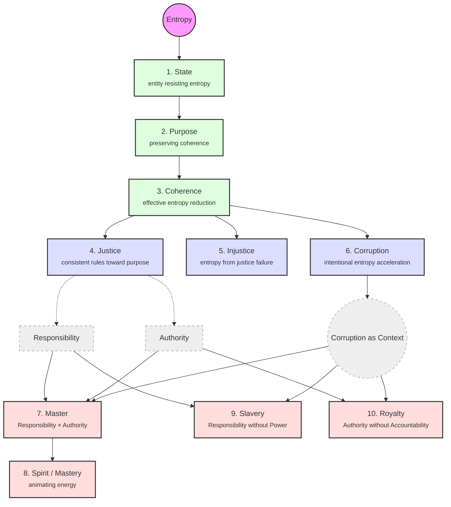

# MODEL: Axiosophy

<!--
  MODEL documents are formal domain model artifacts produced by the /model workflow.
  They formalize a domain's structure using the Structural Domain Modeling Atlas (SDMA).

  See: workflows/model.md for the full protocol specification.
  See: personas/sdma.md for the applied modeling toolkit.
  See: personas/formal-foundations.md for the mathematical foundations.
-->

## Domain Classification

**Problem Statement:**
Axiosophy is a philosophical framework that seeks to ground objective ethics in thermodynamic reality (entropy) rather than subjective morality or categorical imperatives. The associated political disposition, Axiosophism, maps ideologies and power structures against this objective depth. The domain requires formal modeling to rigorously verify its internal consistency, reveal implicit dependencies between concepts, prevent structural contradictions (e.g., the naturalistic fallacy), and mathematically define the relationship between its deductive axioms and its empirical applications.

**Domain Characteristics:**
- **Axiomatic Foundation:** A single, physically verifiable axiom (the Law of Entropy).
- **Hierarchical Ontology:** Ten core interrelated concepts built sequentially from the axiom.
- **Epistemological Measurement:** A three-dimensional "Prism" model mapping political/legal/moral convergence.
- **Constraints over Commands:** Ethics are treated as structural requirements for coherence, not deontological duties.

## Formalism Selection

The formalism selection underwent a rigorous dialectical scrutiny process involving multiple AI reasoning models to prevent overfitting and ensure minimal abstraction. The result is a 5-layer stack that privileges structural domain accuracy over standard computer science paradigms.

| Aspect                  | Detail |
| :---------------------- | :----- |
| **Primary Formalism**   | **Preorder Category with Products** (for the derivation spine and internal node composition) |
| **Supporting Tools**    | **Information Theory** (Entropy), **Structural Implication Graph** (Constraints), **Metric Space** (The Prism), **Formal Concept Analysis** (Duality Validation) |
| **Decision Matrix Row** | N/A (Domain-native formalisms prioritized over standard SDMA formalisms per author directive) |
| **Rationale**           | A single formalism cannot capture both the rigorous deductive derivation (Axiosophy) and the epistemological/empirical measurement of it (Axiosophism). A layered approach ensures each mathematical structure does exactly one job without overfitting. |

**Alternatives Considered & Rejected:**
- *Pure Ologs:* Rejected because strict functional morphisms over-constrain philosophical relationships. Absorbed as product structures within the Preorder.
- *Standard Deontic Logic (SDL):* Rejected as a fatal philosophical contradiction; introduces an absolute "ought" operator ($O$) which violates the premise of deriving ethics from natural constraints.
- *Full Lattices:* Rejected because human social domains rarely possess mathematically perfect unique suprema/infima for every concept pair.
- *Coalgebra:* Rejected as overly complex for this level of modeling; State evolution is modeled more simply as temporal trajectories within the Metric Space.

## Model

The formal model of Axiosophy is stratified into five distinct mathematical layers.

### Layer 1: The Foundational Axiom (Information Theory)

The system rests on a single physical constraint, expressed through Information Theory:

**Axiom 0:** Continuous increase in Shannon Entropy ($H$) is the default state of all social systems left to natural forces.
$$ \frac{dH}{dt} > 0 $$

### Layer 2: The Derivation Spine (Preorder Category)

The ten core definitions form a **Directed Acyclic Graph (DAG)** formalized as a **Preorder Category**, where an arrow $A \to B$ means "$B$ is logically derived from / depends upon the existence of $A$." 

This acts as the definitional spine of the philosophy.

*Formal Note:* Concepts at the same structural depth (e.g., the triad of J, I, K) form an **antichain partition**. There is no derivation arrow between them; they are parallel derivations from the layer above. 
*Composition:* The model defines the Master via categorical product: $Master \cong Responsibility \times Authority$, whereas Slavery and Royalty represent broken projections of that product.

### Layer 3: Ethical Constraints (Structural Implication Graph)

This layer resolves the Is/Ought boundary (the naturalistic fallacy). Axiosophy does not map "oughts" as moral commands, but as **Structural Implications** ($\to$). 

If $C$ is Coherence (survival) and $\neg C$ is Collapse, the ethics are modeled as strict temporal necessities ($\Box$):

1. **The Necessity of Justice:** $\Box(\neg Justice \to \neg C)$
   *(The absence of Justice necessarily implies the failure of Coherence.)*
2. **The Inevitability of Rebellion:** $\Box(Corruption \to \diamondsuit Rebellion)$
   *(The presence of Corruption eventually ($\diamondsuit$) necessitates the emergence of Rebellion among Masters, or the State collapses.)*

Here, "ought" translates to: "If the State desires $C$, it is structurally constrained to enact Justice."

### Layer 4: Measurement (Metric Space and Attractor)

The **Axiosophic Prism** formalizes the application of the philosophy to messy political reality. It is modeled as a 3-dimensional **Metric Space** $\mathcal{M}$ equipped with a point-attractor.

- $x$: Ideology (Continuous variable: Left $\leftrightarrow$ Right)
- $y$: Power Structure (Continuous variable: Anarchy $\leftrightarrow$ Oligarchy)
- $z$: Depth of Objective Understanding (Continuous variable: $z_0$ Surface $\to z_{max}$ Bedrock)

**The Convergence Contraction:**
The system posits an attractor point $A_{justice}$ at the $z_{max}$ conceptual bedrock. As a subject's Bayesian understanding deepens ($z \to z_{max}$), the variance in the $x$ and $y$ dimensions strictly decreases via an epistemological contraction mapping. 

The three strata are qualitative bands of the $z$-axis:
1. **Political (Surface):** Low $z$, high $x,y$ variance. High noise, rhetorical friction.
2. **Legal (Bridge):** Medium $z$, constrained $x,y$ variance. Procedural friction.
3. **Moral (Bedrock):** High $z$, minimal $x,y$ variance. Logical friction. At the limit, ideological labels ($x$) dissolve into pure structural mechanics.

### Layer 5: The Duality (Formal Concept Analysis)

The final layer mathematically bridges empirical observation (How societies actually behave) with deductive theory (The 10 definitions). We use **Formal Concept Analysis (FCA)**.

Let $(G, M, I)$ be a formal context where:
- $G$ (Objects): Existing and historical institutions/states/norms.
- $M$ (Attributes): Structural properties (e.g., "resists entropy", "distributes authority cleanly", "aligns responsibility with power").
- $I$: The incidence relation (which societies possessed which attributes).

A **Galois Connection** links the subset of societies to the subsets of attributes. The resulting **Concept Lattice** derives the definition hierarchy organically.

**The Sacred:** In FCA, the "Sacred" emerges elegantly as the *supreme formal concept* (the formal intent) shared by the *maximal enduring extent* of objects over long spans of time. It is not declared; it is derived backwards through the entropy filter of history.

## Validation

| Check | Result | Detail |
| :---- | :----- | :----- |
| **Acyclic Strictness** | PASS | The Preorder DAG demonstrates no circular definitions. The most advanced concepts (Master, Royalty) trace cleanly back to Entropy without self-reference. |
| **Is/Ought Separation** | PASS | By stripping out deontic logic and formally isolating *Definitional Morphisms* (Layer 2) from *Structural Implications* (Layer 3), the model mathematically proves it does not commit the naturalistic fallacy. It bridges "is" and "ought" purely via systemic constraints. |
| **Duality Well-Formedness** | PASS | The gap between the deductive definitions and the empirical Prism is cleanly resolved by FCA, providing a mathematical justification for how observation maps to theory. |

## Implications

1. **For the Blog Post Rewrite:** The visual "DAG" reveals that the author's previous characterization of the philosophy as a "linear hierarchy" was structurally inaccurate. The rewrite should adopt the DAG's branching structure — explicitly calling out the "triad" (Justice/Injustice/Corruption) and the "quadrad" (Master/Spirit/Slavery/Royalty) as parallel nodes extending from Coherence and Context, respectively.
2. **The Product of Mastery:** By formally defining "Master" as the product of $Responsibility \times Authority$, the rewrite can more fiercely attack the broken projections (Slavery as responsibility without authority; Royalty as authority without responsibility).
3. **Empirical Defensibility:** The formalization of "The Sacred" via FCA allows the author to defend traditional institutions (like the family) not via conservative ideology (which is vulnerable to attack at the surface $z$-layer), but as a derived mathematical truth filtered by the relentless force of thermodynamic entropy over time.
