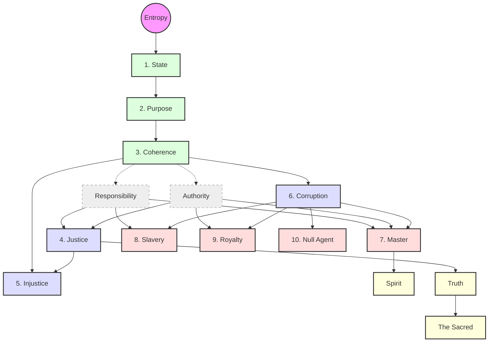

# MODEL: Axiosophy

<!--
  MODEL documents are formal domain model artifacts produced by the /model workflow.
  They formalize a domain's structure using the Structural Domain Modeling Atlas (SDMA).

  See: workflows/model.md for the full protocol specification.
  See: personas/sdma.md for the applied modeling toolkit.
  See: personas/formal-foundations.md for the mathematical foundations.
-->

## Domain Classification

**Problem Statement:**
Axiosophy is a philosophical framework grounding objective ethics in thermodynamic reality (entropy) rather than subjective morality or categorical imperatives. Its companion political disposition, Axiosophism, maps ideologies and power structures against this objective depth via the Axiosophic Prism. Formal modeling is required to verify internal consistency, reveal implicit dependencies, prevent structural contradictions (especially the naturalistic fallacy), and mathematically define the relationship between deductive axioms and empirical applications.

**Domain Characteristics:**
- **Axiomatic Foundation:** A single, physically verifiable axiom (the Second Law of Thermodynamics, expressed via Shannon entropy).
- **Hierarchical Ontology:** Ten numbered definitions plus two derived meta-concepts (Truth, The Sacred), built from the axiom.
- **Constraint-Theoretic Ethics:** A *third mode* of ethical reasoning — neither categorical (Kant) nor consequentialist (Mill) — where obligations are structural constraints analogous to physical laws.
- **Epistemological Measurement:** A three-dimensional Prism model with Bayesian convergence toward an attractor.

## Formalism Selection

The formalism selection underwent a rigorous dialectical scrutiny process involving multiple AI reasoning models to prevent overfitting and ensure minimal abstraction. The result is a 5-layer stack that privileges structural domain accuracy over standard computer science paradigms.

| Aspect                  | Detail |
| :---------------------- | :----- |
| **Primary Formalism**   | **Preorder Category with Products** (for the derivation spine and internal node composition) |
| **Supporting Tools**    | **Information Theory** (Entropy), **Structural Implication Graph** (Constraints), **Metric Space** (The Prism), **Formal Concept Analysis** (Duality Validation) |
| **Decision Matrix Row** | N/A (Domain-native formalisms prioritized over standard SDMA formalisms per author directive) |
| **Rationale**           | A single formalism cannot capture both the rigorous deductive derivation (Axiosophy) and the epistemological/empirical measurement of it (Axiosophism). A layered approach ensures each mathematical structure does exactly one job without overfitting. |

**Alternatives Considered & Rejected:**
- *Pure Ologs:* Rejected because strict functional morphisms over-constrain philosophical relationships. Absorbed as product structures within the Preorder.
- *Standard Deontic Logic (SDL):* Rejected as a fatal philosophical contradiction; introduces an absolute "ought" operator ($O$) which violates the premise of deriving ethics from natural constraints.
- *Full Lattices:* Rejected because human social domains rarely possess mathematically perfect unique suprema/infima for every concept pair.
- *Coalgebra:* Rejected as overly complex for this level of modeling; State evolution is modeled more simply as temporal trajectories within the Metric Space.

## Model

The formal model of Axiosophy is stratified into five distinct mathematical layers.

### Layer 1: The Foundational Axiom (Information Theory)

The system rests on a single physical constraint, expressed through Information Theory:

**Axiom 0:** Continuous increase in Shannon Entropy ($H$) is the default state of all social systems left to natural forces.
$$ \frac{dH}{dt} > 0 $$

**Scoping note:** $H$ in this model measures the *structural disorder of the system's capacity to maintain coherence*, not the behavioral predictability of individual actors. A totalitarian state may appear superficially predictable (low behavioral entropy) while harboring catastrophic structural fragility (high structural entropy). The key variable is *time horizon*: compressed adaptive capacity produces brittleness that accelerates entropy over sustained periods, even when surface-level order appears stable.

### Layer 2: The Derivation Spine (Preorder Category)

The core definitions form a **Directed Acyclic Graph (DAG)** formalized as a **Preorder Category**, where an arrow $A \to B$ means "$B$ is logically derived from / depends upon the prior definition of $A$." 

**Structural notes:**

1. **Responsibility** and **Authority** are *intermediate concepts* that emerge from Definition 3 (the State is Responsible to act Coherently, exercising Authority). They are not standalone numbered definitions but are compositional prerequisites for Justice and the Quadrad.

2. Concepts at the same structural depth form **antichain partitions** — no derivation arrow exists between peers (e.g., Justice, Injustice, Corruption are independently derived from the layer above).

3. **Justice** is the *morphism* mapping the product of Responsibility and Authority toward Purpose: $Justice: (\text{Responsibility} \times \text{Authority}) \to \text{Purpose}$. Master is something you *are* (the object); Justice is something you *do* (the mapping of capacity to teleology).

4. **Master** is the *product* of Responsibility and Authority *in the context of Corruption*: $Master \cong \text{Responsibility} \times \text{Authority} \times \text{Corruption}_{\text{context}}$. The remaining Quadrad members are **projections** of this product: Slavery and Royalty are *broken projections* (each missing one factor); the **Null Agent** is the *null projection* ($\neg R \times \neg A$ in Corruption context) — the actor with neither duty nor power, whose structural inertness constitutes passive collaboration with entropy.

5. **Spirit** is a *derived meta-concept* from Mastery ($M \to Sp$): the animating force that emerges from disciplined exercise of Responsibility and Authority. It is not a structural position in the Quadrad but the *energy* that makes a Master more than a functionary. Spirit operates on a different categorical plane than the Quadrad's Authority×Responsibility configurations.

6. **Truth** and **The Sacred** are *meta-definitions* derived from the hierarchy: Truth = that which empirically sustains Purpose; The Sacred = Truth battle-tested across eras. They sit atop the DAG as derived conclusions, not axioms. Spirit, Truth, and The Sacred together form the model's derived meta-concept tier.

### Layer 3: Ethical Constraints (Structural Implication Graph)

This layer resolves the Is/Ought boundary. Axiosophy does not model "oughts" as moral commands but as **Structural Implications** — consequences that follow from thermodynamic necessity, not from a primitive obligation operator.

The key analogy: you don't have a *moral duty* to obey gravity; you simply fall if you ignore it. Axiosophy frames ethical constraints identically.

Let $C$ denote Coherence (the State maintaining its Purpose against entropy). The constraints are modeled as temporal necessities ($\Box$) and eventualities ($\diamondsuit$):

1. **The Necessity of Justice:** $\Box(\neg Justice \to \neg C)$
   *The absence of Justice necessarily leads to the failure of Coherence.*

2. **The Inevitability of Rebellion or Collapse:** $\Box(Corruption \to \diamondsuit(Rebellion \lor Collapse))$
   *The presence of Corruption eventually forces a bifurcation: either the Master class mounts a Rebellion (an immune response to restore Coherence), or the dissipative structure dies. Rebellion is specifically a Master-produced phenomenon — the Spirit of Rebellion — not a spontaneous event.*

3. **The Entropy of Slavery:** $\Box(Slavery \to \frac{dH}{dt} \gg 0)$
   *Slavery (forced responsibility without authority) actively accelerates entropy — it is not merely unjust but structurally destabilizing.*

**The constraint-theoretic mode:** "Ought" translates to a hypothetical imperative: "If the State desires $C$, then it is structurally constrained to enact Justice." This is neither categorical (Kant's unconditional duty) nor consequentialist (Mill's outcome optimization) — it is a *structural constraint* that emerges from the physics of coherence.

### Layer 4: Measurement (Metric Space and Attractor)

The **Axiosophic Prism** formalizes the application of the philosophy to messy political reality. It is modeled as a 3-dimensional **Metric Space** $\mathcal{M}$ equipped with a point-attractor.

- $x$: Ideology (Continuous variable: Left $\leftrightarrow$ Right)
- $y$: Power Structure (Continuous variable: Anarchy $\leftrightarrow$ Oligarchy)
- $z$: Depth of Objective Understanding (Continuous variable: $z_0$ Surface $\to z_{max}$ Bedrock)

**The Convergence Contraction:**
The system posits an attractor point $A_{justice}$ at the $z_{max}$ conceptual bedrock. As a subject's Bayesian understanding deepens ($z \to z_{max}$), the variance in the $x$ and $y$ dimensions strictly decreases via an epistemological contraction mapping. 

The three strata are qualitative bands of the $z$-axis:
1. **Political (Surface):** Low $z$, high $x,y$ variance. High noise, rhetorical friction.
2. **Legal (Bridge):** Medium $z$, constrained $x,y$ variance. Procedural friction.
3. **Moral (Bedrock):** High $z$, minimal $x,y$ variance. Logical friction. At the limit, ideological labels ($x$) dissolve into pure structural mechanics.

### Layer 5: The Duality (Formal Concept Analysis)

The final layer bridges empirical observation (how societies actually behave) with deductive theory (the definitions). **Formal Concept Analysis** (Wille, 1982) derives concept hierarchies from data using Galois connections.

Let $(G, M, I)$ be a formal context where:
- $G$ (Objects): Historical and existing institutions, states, and norms.
- $M$ (Attributes): Axiosophic structural properties.
- $I \subseteq G \times M$: The incidence relation (which entities exhibit which properties).

**Illustrative Formal Context (simplified):**

| | Resists entropy | Aligns R with A | Distributes authority | Endures across eras | Accelerates entropy |
|:---|:---:|:---:|:---:|:---:|:---:|
| Roman Republic (early) | ✓ | ✓ | ✓ | | |
| Roman Empire (late) | | | | | ✓ |
| Nuclear family | ✓ | ✓ | | ✓ | |
| Common law tradition | ✓ | ✓ | ✓ | ✓ | |
| Feudal aristocracy | | | | | ✓ |
| Open-source software | ✓ | ✓ | ✓ | | |

A **Galois Connection** establishes two order-reversing maps between the powerset of $G$ and the powerset of $M$. The resulting **Concept Lattice** organizes formal concepts (pairs of extent and intent) into a hierarchy.

**Deriving the Sacred:** In FCA, "The Sacred" is not declared — it *emerges* as the formal concept whose intent (attribute set) is shared by the maximal enduring extent (the entities that have persisted longest against entropy). The family, common law, and similar institutions survive the entropy filter not because they are ideologically conservative but because they structurally satisfy the axiosophic attributes.

**The Axiosophy↔Axiosophism Duality:** FCA formalizes the Galois connection between:
- **Axiosophy** (deductive): The stipulated definitions (intension)
- **Axiosophism** (inductive): The observed entities and their properties (extension)

If the concept lattice derived from empirical data matches the stipulated hierarchy, the philosophy's internal consistency is externally validated.

## Validation

| Check | Result | Detail |
| :---- | :----- | :----- |
| **Acyclic Strictness** | PASS | The Preorder DAG contains no circular definitions. Master, Royalty, and The Sacred all trace cleanly back to Entropy without self-reference. |
| **Is/Ought Separation** | PASS | Definitional morphisms (Layer 2) are formally isolated from structural implications (Layer 3). The model does not commit the naturalistic fallacy — it bridges "is" and "ought" via hypothetical imperatives grounded in thermodynamic constraint. |
| **Product Consistency** | PASS | Master = Responsibility × Authority × Corruption-context (full product). Slavery = Responsibility × Corruption-context (broken projection, missing Authority). Royalty = Authority × Corruption-context (broken projection, missing Responsibility). Null Agent = Corruption-context only (null projection, missing both). The Quadrad is the structurally complete set of all four projections. |
| **Morphism Typing** | PASS | Justice is typed as a morphism $Justice: (R \times A) \to Purpose$, not as an object. Master is something you *are*; Justice is something you *do*. |
| **Duality Well-Formedness** | PASS | FCA's Galois connection cleanly bridges the deductive hierarchy (axiosophy) to empirical observation (axiosophism). The Sacred emerges as a derived formal concept. |
| **Completeness** | PASS | Truth, The Sacred, and Spirit are explicitly represented as derived meta-concepts. The hierarchy is complete from Entropy through the Quadrad to the derived tier. |

## Implications

1. **The hierarchy is a DAG, not a chain.** The blog post's presentation as a "linear hierarchy" (numbered list 1–10) obscures the true structure. The rewrite should make the branching points explicit: Coherence spawns a **triad** (Justice/Injustice/Corruption); Corruption-as-context spawns a **quadrad** (Master/Slavery/Royalty/Null Agent). Spirit is a derived meta-concept from Mastery, not a Quadrad member.

2. **Responsibility and Authority are intermediate concepts.** They emerge from Definition 3 (the State's obligation to act Coherently), not from Justice. The blog post's current phrasing conflates their introduction with Definition 4. The rewrite should introduce them after Coherence and before Justice.

3. **The broken projections are the philosophy's sharpest weapon.** Slavery (responsibility without authority) and Royalty (authority without accountability) are *structurally symmetric mirror images* — each missing one leg of the product that constitutes Mastery. This is more powerful than merely naming them as moral categories.

4. **The Sacred must be promoted to a formal derivation.** Currently it appears in prose after the numbered list. The model reveals it is a *derived meta-concept* (Truth → Sacred) that concludes the hierarchy. The rewrite should present it as the capstone.

5. **Constraint-theoretic ethics is the central philosophical innovation.** The deontic logic rejection revealed that axiosophy operates in a genuinely novel *third mode* of ethical reasoning (neither Kantian nor Millian). The rewrite should name this explicitly and defend it as the framework's primary contribution to moral philosophy.
